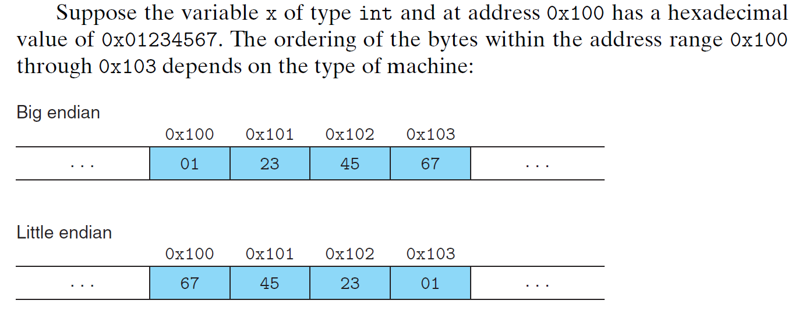

# Representing and Manipulating Information

## Information Storage

- bytes
  - blocks of eight bits
  - smallest *addressable* unit of memory

- address
  - identify every single byte of memory associated a unique number

- virtual address space
  - the set of all possible address

### Hexadecimal Notation

Base 16: Decimal `0-15` Binary `0000-1111` and Hex `0-F`

### Data Sizes

- word size := nominal size of pointer data (max number of bits in an address)
  - pointer uses entire word size
- this is the determines the maximum size of virtual address space
- for a machine with a $w$-bit word size, the virtual addresses can range from $0$ to $2^w − 1$, giving the programm access to $2^w$ locations
  - 64bit computers can theoretically address $2^{64}$ memory locations
- when the CPU reads or writes data, it typically does so in chunks equal to its word size

Depending on $w$, different data types use diferent number of bits in C.

### Addressing and Byte Ordering

- Note that multi-byte objects is always stored contiguously
  - If variable `x` of type `int` (32-bit) has address `0x100`
  - Hence it has 4 bytes, first byte stored in `0x100`, then `0x101`, `0x102`, `0x103`



```
big endian := the most significant byte comes first (IBM and Sun Microsystems machines)
little endian := the least significant byte comes first (Intel-compatible machines)
```

- `one hex digits == 4 bits`
- `one byte := 8 bits == 2 hex digits`

### Representing Code

Note that the same piece of C code compiles to different binaries on different machines. Hence binary code is seldom portable across machines.

### Introduction to Boolean Algebra

Boolean Algebra := Binary values `1` and `0` encode logic values `True` and `False`, while operations   `~, &, |, ^` encode logical operations `Not, And, Or, and Exclusive-Or`, respectively. `a ^ a = 0` `(a ^ b) ^ a = b`

One useful application of bit vectors is to represent finite sets. We can encode anysubset $A ⊆ {0,1,...,w−1}$ with a bit vector $[a_{w−1},...,a_1,a_0]$, where $a_i = 1$ if and only if $i ∈ A$.

We can selectively enable or disable different signals by specifying a bit-vector mask, where a 1 in bit position i indicates that signal i is enabled, and a 0 indicates that it is disabled. Thus, the mask represents the set of enabled signals.

### Bit-Level Operations in C

`|` for Or, `&` for And, `~` for Not, and `^` for Exclusive-Or.

```c
void inplace_swap(int *x, int *y) {
  //clever way to swap 2 values without using a temporary variable
    *y=*x^*y; //step1
    *x=*x^*y; //step2
    *y=*x^*y; //step3
}
```

| step | *x |*y |
| ---- | -- | -- |
| initially | a | b |
| step1     | a | a^b|
| step2     | b | a^b|
| step3     | b | a |

XOR Properties Used
* `a ^ a = 0` (XOR with self equals zero)
* `a ^ 0 = a` (XOR with zero equals self)
* `a ^ b = b ^ a` (XOR is commutative)
* `(a ^ b) ^ c = a ^ (b ^ c)` (XOR is associative)

One common use of the bit-level operations is to implement masking operations, where a mask is a bit pattern that indicates a selected set of bits within a word. As a example, the operation `x` & `0xFF` yields a value consisting of the least significant *byte* of x, but with all other bytes set to `0`. With `x = 0x89ABCDEF`, the expression would yield `0x000000EF`.

### Logical Operations in C

C provides a set of logical operators `||`, `&&`, and `!`, which correspond to the Or, And, and Not operations of logic. Watch out to differentiate between bit operations `&` and logical operations `&&` - the two behave very differently!

  - these will always return `0` or `1`
  - operate on `0` will return `False`
  - operate on anything non-zero will return `True`

```
Expression Result
!0x41 -> 0x00
!0x00 -> 0x01
!!0x41 -> 0x01
0x69 && 0x55 -> 0x01
0x69 || 0x55 -> 0x01
```

Logical operators do not evaluate their second argument if the result of the expression can be determined by evaluat- ing the first argument.

### Shift Operations in C

**Left Shift `x<<y`**
For an operand `x` having bit representation $[x_{n−1}, x_{n−2}, . . . , x_0]$, the C expression `x << k` yields a value with bit representation $[x_{n−k−1}, x_{n−k−2},...,x_0,0,...0]$. That is, x is shifted k bits to the left, dropping off the k most significant bits (on the left) and filling the right end with k zeros.

**Right Shift `x>>y`**
- logical right shift: fills the left end with k zeros, giving a result $[0, . . . , 0, x_{n−1}, x_{n−2}, . . . x_k]$
- arithmetic right shift: fills the left end with k repetitions of the most significant bit (leftmost bit), giving a result $[x_{n−1}, . . . , x_{n−1}, x_{n−1}, x_{n−2}, . . . x_k]$.

In practice, almost all compiler/machine combinations use arithmetic right shifts for signed data, and many programmers assume this to be the case.

Java, on the other hand, has a precise definition of how right shifts should be performed. The expression x >> k shifts x arithmetically by k positions, while x >>> k shifts it logically.

When shifting amount $k >= w$, the shift amount is effectively computed as $k \bmod w$. However, this behavior is not guaranteed for C programs.

## Integer Representations


### Two's-Complement Encodings

We convert the bit representations $X=[x_{w-1}, x_{w-2}, ..., x_0]$ to its numeric value.

For unsigned representations (binary to unsigned),

$$
B2U(X) = \sum_{i=0}^{w-1} x_i \cdot 2^i
$$

For two's complement representations (binary to two's):

$$B2T(X)= -x_{w-1} \cdot 2^{w-1}+\sum_{i=0}^{w-2}x_{i} \cdot 2^{i}$$

The most significant bit indicates sign (0 for nonnegative, 1 for negative). If 0 then this bit does nothing, if 1 then take the negative of this bit's value.

Example:

`15213: 00111011 01101101`
`-15213: 11000100 10010011`

| Weight | Binary (15213) | Value | Binary (-15213) | Value |
|--------|-----|-------|-----|-------|
| 1      | 1   | 1     | 1   | 1     |
| 2      | 0   | 0     | 1   | 2     |
| 4      | 1   | 4     | 0   | 0     |
| 8      | 1   | 8     | 0   | 0     |
| 16     | 0   | 0     | 1   | 16    |
| 32     | 1   | 32    | 0   | 0     |
| 64     | 1   | 64    | 0   | 0     |
| 128    | 0   | 0     | 1   | 128   |
| 256    | 1   | 256   | 0   | 0     |
| 512    | 1   | 512   | 0   | 0     |
| 1024   | 0   | 0     | 1   | 1024  |
| 2048   | 1   | 2048  | 0   | 0     |
| 4096   | 1   | 4096  | 0   | 0     |
| 8192   | 1   | 8192  | 0   | 0     |
| 16384  | 0   | 0     | 1   | 16384 |
| -32768 | 0   | 0     | 1   | -32768|
| Sum    |     | 15213 |     | -15213|

### Numeric Ranges

**Unsigned Values**
* ${UMin} = 0$
  * `000...0`
* ${UMax} = 2^w - 1$
  * `111...1`

**Two's Complement Values**
* ${TMin} = -2^{w-1}$
  * `100...0`
* ${TMax} = 2^{w-1} - 1$
  * `011...1`
* $-1$
  * `111...1`

**Values for W = 16 (16 bits)**

| | Decimal | Hex | Binary |
|---|---|---|---|
| UMax | 65535 | FF FF | 11111111 11111111 |
| TMax | 32767 | 7F FF | 01111111 11111111 |
| TMin | -32768 | 80 00 | 10000000 00000000 |
| -1 | -1 | FF FF | 11111111 11111111 |
| 0 | 0 | 00 00 | 00000000 00000000 |

The two’s-complement range is asymmetric:

$$|TMin| = |TMax| + 1$$
$$ {UMax} = 2 *{TMax} + 1$$

### Conversions Between Signed and Unsigned

For the same bit representation, the below functions convert the corresponding numeric values between both kinds of representations.

**Two's to Unsigned**


$$
T2U_w(x) = \begin{cases} 
x + 2^w, & x < 0 \\
x, & x \geq 0
\end{cases}
$$

**Unsigned to Two's**


$$
U2T_w(u) = \begin{cases}
u, & u \leq TMax_w \\
u - 2^w, & u > TMax_w
\end{cases}
$$

**Casting**

```c
int tx, ty;
unsigned ux, uy;
//casted to signed
tx = (int) ux;
//casted to unsigned
uy = (unsigned) ty; 
```

> If there is a mix of unsigned and signed in single expression,  signed values implicitly *cast to unsigned* - be careful with this
> Signed representations are usually safer

### Expanding the Bit Representation of a Number

- To convert an unsigned number to a larger data type, we can simply add leading zeros to the representation (on the left); this operation is known as *zero extension*.
- For converting a two’s- complement number to a larger data type, the rule is to perform a *sign extension*, adding copies of the most significant bit to the representation (on the left)
  - If MSB is 0, then add a bunch of 0
  - If MSB is 1, then add a bunch of 1

> Numeric value is preserved when expanding to more bits

### Truncating Numbers

Let $\vec{x}$ be the bit vector $[x_{w-1}, x_{w-2}, ..., x_0]$. Let $\vec{x}'$ be the result of truncating it to $k$ bits: $\vec{x}' = [x_{k-1}, x_{k-2}, ..., x_0]$. We do this by dropping the leftmost $w-k$ bits.

- **Unsigned Numbers**:  Numeric value $x = B2U_w(\vec{x})$ and $x' = B2U_k(\vec{x}')$. Then $x' = x \bmod 2^k$.
- **Two's Complement Numbers**: Numeric value $x = B2T_w(\vec{x})$ and $x' = B2T_k(\vec{x}')$. Then $x' = U2T_k(x \bmod 2^k)$

> Truncating a number can alter its numeric value — a form of overflow!

## Integer Arithmetic

Due to fixed size of binary digits, we'd have to truncate the leftmost bits, when doing arithmetic. This leaders to weird behaviour like adding 2 positive numbers to give a negative number.

### Addition / Negation


Regular integer addition with only 4 bits may result in a sum requiring 5 bits to represent (shown above). We hence introduce fixed-size addition.

#### Unsigned Addition

- Let us define the operation $+_w^u$ for arguments $x$ and $y$, where $0 \leq x, y < 2^w$, as the result of truncating the integer sum $x + y$ to be $w$ bits long and then viewing the result as an unsigned number
  - Recall for a $w$-bit unsigned number, $x$ varies from $0$ to $2^w-1$
- This is basically modular arithmetic, computing $(x+y) \bmod 2^w$ by simply discarding any bits more than $w$ on the left
  - For example, consider a 4-bit number representation with $x = 9$ and $y = 12$, having bit representations `[1001]` and `[1100]`, respectively. Their sum is 21, having a 5-bit representation `[10101]`. But if we discard the high-order bit, we get `[0101]`, that is, decimal value 5. This matches the value $21 \bmod 16 = 5$.

Then,

$$
x +_w^u y = \begin{cases}
x + y, & x + y < 2^w & \text{Normal} \\
x + y - 2^w, & 2^w \leq x + y < 2^{w+1} & \text{Overflow}
\end{cases}
$$


> An arithmetic operation is said to overflow when the full integer result cannot
fit within the word size limits of the data type

We can see regions where overflow occurs and integer additions proceed normally.

#### Unsigned Negation

For every $x$, there must be some value $-_w^u{x}$ such that $+_w^u{x} -_w^u{x} =0$. The "negative" number $-_w^u{x}$ is actually positive, such that when added to $x$, wrap around to give 0.

$$
-^u_w x = \begin{cases} 
x, & x = 0 \\
2^w - x, & x > 0
\end{cases}
$$

#### Two's Complement Addition

> unsigned addition and two's complement addition give the same bit level representation

For integer values x and y in the range $-2^{w-1} \leq x, y \leq 2^{w-1} - 1$ (range of two's number):

$$
x +^t_w y = \begin{cases}
x + y - 2^w, & 2^{w-1}-1 \lt x + y & \text{Positive overflow} \\
x + y, & -2^{w-1} \leq x + y \leq 2^{w-1}-1 & \text{Normal} \\
x + y + 2^w, & x + y < -2^{w-1} & \text{Negative overflow}
\end{cases}
$$


#### Two's Complement Negation

For x in the range $TMin_w \leq x \leq TMax_w$, its two's-complement negation $-^t_w x$ is given by the formula

$$
-^t_w x = \begin{cases}
TMin_w, & x = TMin_w \\
-x, & x > TMin_w
\end{cases}
$$

> One technique for performing two’s-complement negation at the bit level is to complement the bits and then increment the result. 
> In C, for `int x`, `-x == ~x+1`

### Multiplication

#### Unsigned Multiplication

Integers $x$ and $y$ in the range $0 \leq x, y \leq 2^w - 1$ can be represented as $w$-bit unsigned numbers, but their product $x \cdot y$ can range between $0$ and $(2^w - 1)^2$. This could require as many as $2w$ bits to represent. Instead, unsigned multiplication in C is defined to yield the $w$-bit value given by the low-order $w$ bits of the $2w$-bit integer product. Let us denote this value as $x *^u_w y$.

Truncating an unsigned number to $w$ bits is equivalent to computing its value modulo $2^w$, giving the following:

$$x *^u_w y = (x \cdot y) \bmod 2^w$$

**Multiplication in Binary**
```
    0011    (3)
×   0101    (5)
---------
    0011    (from rightmost 1)
   0000     (from 0, so nothing)
  0011      (from 1 in position 2)
 0000       (from 0, so nothing)
---------
    1111    = 15 in decimal
```

#### Two's Complement Multiplication

$$x *_w^t y = U2T_w((x \cdot y) \bmod 2^w)$$

### Multiplying by Constants

#### Multiplcation by a factor of 2

For C variables $x$ and $k$ with (either unsigned/twos complement) values `x` and `k`, such that $0 ≤ k <w$, the C expression `x << k` yields the value $x * 2^k$

> note that multiplying in either unsigned/twos complement can cause overflow

#### Multiplication by a general factor

Consider the task of generating code for the expression `x * K`, for some constant `K`, we can compute the effect of these bits on the product using either of two different forms:

* Form A: $(x<<n) + (x<<n−1) + . . . + (x<<m)$
* Form B: $(x<<n+1) - (x<<m)$

The two different shifts — logical and arithmetic — serve the purpose for division of unsigned and two’s complement numbers, respectively. Since multiplication is computationally expensive, we can decompose multiplication to a series of shifts and add for optimizations.

### Division by factor of 2

Let C variables x and k have two's-complement value $x$ and unsigned value $k$, respectively, such that $0 \leq k < w$. The C expression `x >> k`, when the shift is performed arithmetically, yields the value $\lfloor x/2^k \rfloor$

However, unlike multiplication, we can't express division by arbitrary constants K in terms of division by powers of 2.

## Floating Point

### Fractional Binary Numbers


We can represent fractions in binary,  $b = \sum_{k=-j}^i 2^k * b_k$. Bits to the right of the binary point represent powers of 2.
- we can only have one setting of the binary point, so limited range of numbers

### IEEE Floating-Point Representation

The IEEE floating-point standard represents a number in a form

$$V = (−1)^s × M × 2^E$$


* single sign bit `s` encodes the sign $s$
* `k`-bit exponent field `exp` encodes the exponent $E$
* `n`-bit fraction field `frac` encodes the significand $M$

* `single-precision := s=1, k=8, n=23 s=bits[31] exp=bits[30:23] frac=bits[22:0]`
* `double-precision := s=1, k=11, n=52 s=bits[63] exp=bits[62:52] frac=bits[51:0]`

**Case 1: Normalized**

Condition `(exp!=00...00) && (exp!=11...11)`:
- $E = Exp -Bias$
  - $Exp$ is the unsigned value of `exp`
  - $Bias=2^{k-1}-1$ where k is the length of `exp`
  - Single precision: `k=8`, $1 \leq Exp \leq 254$, $-126 \leq E \leq 127$
- Signficand coded with implied leading 1, $M=1.x...xx_2$
  - $x...xx$ is the bits of `frac`
  - Math means `frac=0...00` is $0$ and `frac=1...11` is $1$

**Case 2: Denormalized**

Condition `exp=00...00`:
- $E = 1 - Bias$ (instead of $E = 0 -Bias$)
- significand coded with implied leading 0, $M=0.x...xx_2$
  - $x...xx$ represents bits of `frac`

Cases
- `exp=00...00 && frac=00...00`:
  - Represents zero value
  - Two distinct values: +0 and -0 (due to sign bit)
- `exp=00...00 && frac≠00...00`:
  - Numbers closest to 0.0
  - Values are equispaced

**Case 3: Special Values**

Condition `exp=11...11`:
- When `exp=11...11 && frac=00...00`:
  - Represents $\infty$ (infinity)
  - Results from overflow operations
  - Can be positive or negative based on sign bit
- When `exp=11...11 && frac≠00...00`:
  - Not-a-Number (NaN)
  - Used when no numeric value exists
  - Examples: $\sqrt{-1}$, $\infty - \infty$, $\infty \times 0$


Note the numbers represented are not spaced evenly.

### Rounding

When at a "halfway" point, we round to nearest even number (where LSE is `0`)

### Floating-Point Operations

Floating point operations lack associativity and distributivity, but are commutative.

### Floating Point in C

And casting values between `int`, `float`, `double`:

- From `int` to `float`, the number can't overflow, but it may be rounded.
- From `int` or `float` to `double`,the exact numeric value can be preserved.
- From `double` to `float`, the value can overflow or rounded.
- From `float` or `double` to `int`, the value will be rounded toward zero. value may overflow.

Floating-point arithmetic must be used very carefully, because it has only limited range and precision, and because it does not obey common mathematical properties such as associativity.

## Miscs

`~x+1` is equivalent to `-x`.

`(1<<k)-1` to generate masks.