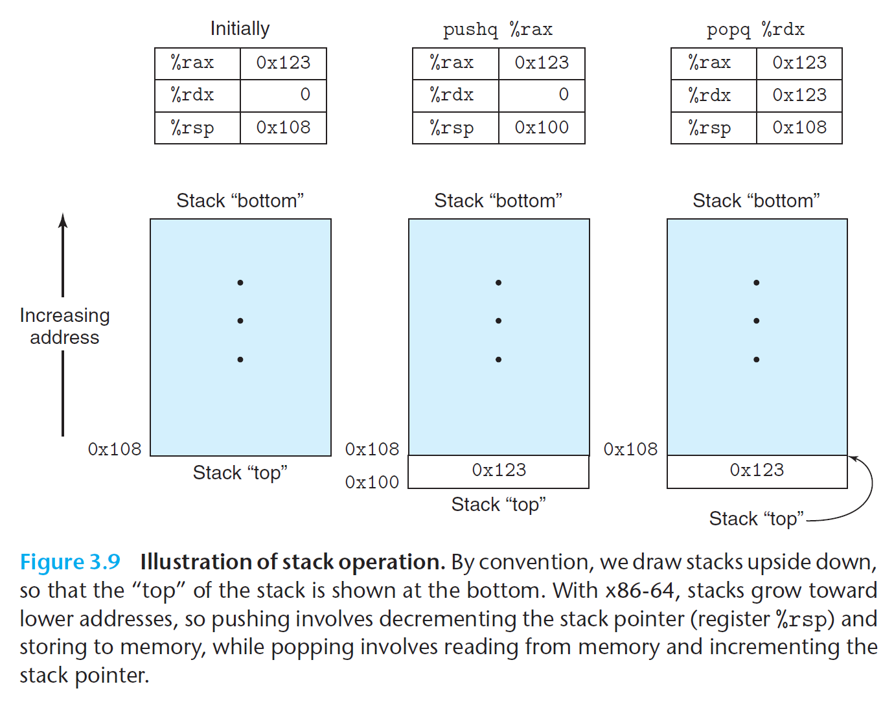
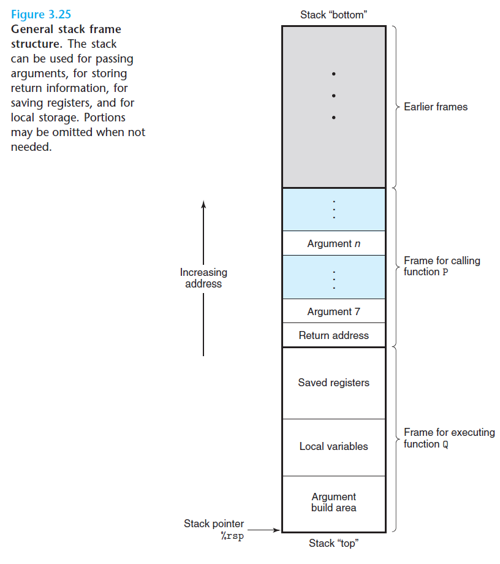
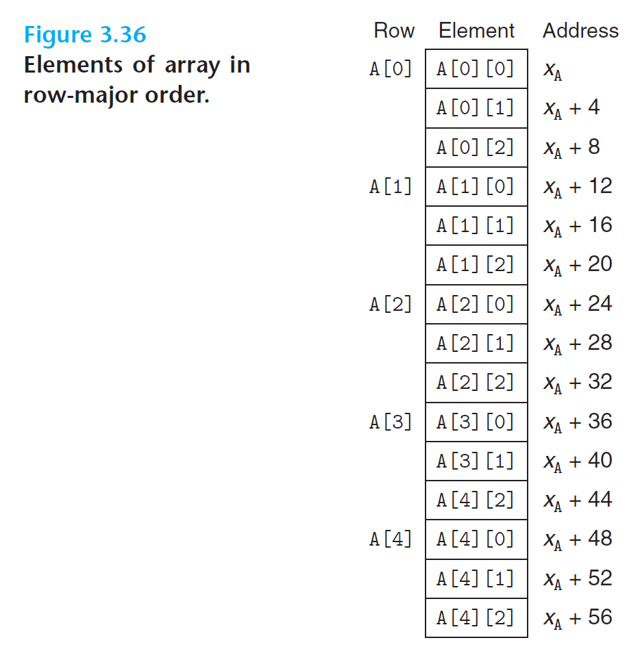

# Machine-Level Representation of Programs

## Program Encodings

Process of GCC command:

```c
#include <stdio.h>

int main() {
  printf("hello, world\n");
  return 0;
}

/**
 * hello program life:
 *                                                                                          printf.o --|
 *                pre-processor               compiler                      assembler                  |--> linker
 *    hello.c    -------------->   hello.i   ---------->     hello.s      -------------->    hello.o    ------------>   hello
 * (source file)                ( modified              (assembly program)               ( relocatable               ( executable
 *                               source file )                                            object programs )          object programs )
 *                                                                                           (binary)                   (binary)
 * 
 * - Preprocessing phase: modifies the original C program according to directives thar begin with the '#' character, and result is another C program, typically with the .i suffix.
 * 
 * - Compilation phase: translate .i to .s, which is an assembly-language program.
 *                      Assembly language is useful because it provides a common output language for different compilers for different hight-level languages.  
 *
 * - Assembly phase: translate .i to .o, which is mechine-language instructions, but it only contains main function(so hello.o contain gibberish text).
 *
 * - Linking phase: merging other .o files.
 * 
 * */ 

/**
 * GCC instance:
 * 
 * 1. -------------
 * gcc hello.c 
 * ---------------- default ouput an executable file named a.out
 *
 * 2. -------------
 * gcc hello.c -o hello
 * ---------------- output an executable file named hello
 * 
 * 3. -------------
 * gcc -E hello.c -o hello.i
 * ---------------- preprocessing and output a file named hello.i
 * 
 * 4. -------------
 * gcc -S hello.i
 * ---------------- translate hello.i to hello.s
 * 
 * 5. -------------
 * gcc -c hello.s
 * ---------------- translate hello.s to hello.o
 * 
 * 6. -------------
 * gcc hello.o -o hello2
 * ---------------- translate hello.o to an executable file named hello2
 * 
 * 7. -------------
 * gcc -O1 hello.c -o hello3
 * ---------------- open O1 optimizer
 * */
 ```

### Machine Level Code

For machine level programming:

* *Instruction set architecture*, or **ISA** (including IA32 and x86-64) defines the processor state, the format of the instructions, and the effect each of these instructions will have on the state.
* The *memory addresses* used by a machine-level program are virtual addresses, providing a memory model that appears to be a very large byte array.

Parts of the processor state are visible that normally are hidden from the C programmer:

* The *program counter* (commonly referred to as the “PC,” and called %eip in IA32) indicates the address in memory of the next instruction to be executed
* The *integer register* for x86-64 contains 16 named locations storing 64-bit values. Can hold addresses or data. Only about 16 registers in a computer!
* The *condition code registers* hold status information about the most recently executed arithmetic or logical instruction.
* A set of *floating-point registers* store floating-point data.

The program memory contains the executable machine code for the program, some information required by the operating system, a run-time stack for managing procedure calls and returns, and blocks of memory allocated by the user (for example, by using the malloc library function).

```
Assembly Code (Instructions) ↔ Registers ↔ Memory (Stack/Heap/Static) ↔ I/O
```

## Data Formats

Size of C data types in x86-64:

|C declaration|Intel data type|Assembly code suffix|Size(bytes)|
|-|-|-|-|
|char|Byte|b|1|
|short|Word|w|2|
|int|Double word|l|4|
|long int|Double word|l|4|
|long long int|-|-|4|
|char *|Double word|l|4|
|float|Single precision|s|4|
|double|Double precision|l|8|
|long double|Extented precision|t|10/12|

## Accessing Information

An x86-64 CPU contains a set of 16 **general-purpose registers** storing 64-bit values. Theses register are used to store integer data as well as pointers.

| 63 - 0 | 31 - 0 | 15 - 0 | 7 - 0|  description   |
| -      |  -     | -      | -    |     -          |
| %rax   | %eax   | %ax    | %al  |  return value  |
| %rbx   | %ebx   | %bx    | %bl  |  callee saved  |
| %rcx   | %ecx   | %cx    | %cl  |  4th argument  |
| %rdx   | %edx   | %dx    | %dl  |  3rd argument  |
| %rsi   | %esi   | %si    | %sil |  2nd argument  |
| %rdi   | %edi   | %di    | %dil |  1st argument  |
| %rbp   | %ebp   | %bp    | %bpl |  callee saved  |
| %rsp   | %esp   | %sp    | %spl |  stack pointer |
| %r8    | %r8d   | %r8w   | %r8b |  5th argument  |
| %r9    | %r9d   | %r9w   | %r9b |  6th argument  |
| %r10   | %r10d  | %r10w  | %r10b|  callee saved  |
| %r11   | %r11d  | %r11w  | %r11b|  callee saved  |
| %r12   | %r12d  | %r12w  | %r12b|  callee saved  |
| %r13   | %r13d  | %r13w  | %r13b|  callee saved  |
| %r14   | %r14d  | %r14w  | %r14b|  callee saved  |
| %r15   | %r15d  | %r15w  | %r15b|  callee saved  |

### Operand Specifiers

Most instructions have one or more operands specifying the source values to use
in performing an operation and the destination location into which to place the result.

* *immediate* is for constant values. written with a `$` followed by an integer e.g.`$0x400`, `$-533` 
* *register* denotes the contents of one of the registers e.g. `%rax` , `%r13`
* *memory* reference accesses some memory location according to a computed address (often called the *effective address*).

### Data Movement Instructions

```
mov Source, Destination
```

Operations such as `movb` (for bytes) or `movw` (for words) move data from a source to a destination. Different variation of `mov` for different data types. The source operand designates a value that is immediate, stored in register, or stored in memory. The destination operand designates a location that is either a register or a memory address. Hence x86 cannot have both source and destination as memory locations. The following combinations are possible:

```x86asm
movl $0x4050,%eax Immediate--Register, 4 bytes
movw %bp,%sp Register--Register, 2 bytes
movb (%rdi,%rcx),%al Memory--Register, 1 byte
movb $-17,(%esp) Immediate--Memory, 1 byte
movq %rax,-12(%rbp) Register--Memory, 8 bytes
```

**Example**
```c
long exchange(long* xp, long y) {
    long x = *xp;
    *xp = y;
    return x;
}
```
```bash
gcc -Og -c exchange.c
objdump -d exchange.o
```
```nasm
;xp and y are stored register %rdi and %rsi
0000000000000000 <exchange>:
   0:   f3 0f 1e fa             endbr64
    ;loads the value that xp points to into %rax.
    ;read from memory, store in register
    ;note that () is the dereferencing operator in asm
   4:   48 8b 07                mov    (%rdi),%rax 
   ;stores y into the location pointed to by xp
   7:   48 89 37                mov    %rsi,(%rdi)
   a:   c3                      ret    
```

* “pointers” in C are simply addresses. Dereferencing a pointer involves
copying that pointer into a register, and then using this register in a memory
reference
* local variables such as x are often kept in registers rather than
stored in memory locations. Register access is much faster than memory access.

## Pushing and Popping Stack



The stack grows downwards here, so the "top" of the stack is at the lowest address. The stack pointer `%rsp` holds the address of the top stack element. The `pushq` instruction provides the ability to push data onto the stack, while the `popq` instruction pops it. 

Pushing a quad word value onto the stack involves first decrementing the stack pointer by 8 and then writing the value at the new top-of-stack address. Equivalent to:
```nasm
subq 8, %rsp ;decrement stack pointer
movq %rax, (%rsp) ;store rax onto the stack
```

Popping a quad word involves reading from the top-of-stack location and then incrementing the stack pointer by 8. Equivalent to:
```nasm
movq (%rsp),%rdx ;move data to %rdx
addq $8,%rsp ;Increment stack pointer
```


## Arithmetic and Logical Operations

| Instruction | Arguments | Effect | Description |
|-------------|-----------|---------|-------------|
| `leaq` | S, D | D ← &S | Load effective address |
| `INC` | D | D ← D+1 | Increment |
| `DEC` | D | D ← D-1 | Decrement |
| `NEG` | D | D ← -D | Negate |
| `NOT` | D | D ← ~D | Complement |
| `ADD` | S, D | D ← D + S | Add |
| `SUB` | S, D | D ← D - S | Subtract |
| `IMUL` | S, D | D ← D * S | Multiply |
| `XOR` | S, D | D ← D ^ S | Exclusive-or |
| `OR` | S, D | D ← D \| S | Or |
| `AND` | S, D | D ← D & S | And |
| `SAL` | k, D | D ← D << k | Left shift |
| `SHL` | k, D | D ← D << k | Left shift (same as SAL) |
| `SAR` | k, D | D ← D >>ₐ k | Arithmetic right shift |
| `SHR` | k, D | D ← D >>ₗ k | Logical right shift |

`lea` or `leaq` calculates an address but doens't actually access memory
- `lea 0x4(%rsp),%rbx` means to take the address in `%rsp`, add 4 to it, and put the new address in `%rbx`

## Control

Machine code provides two basic low-level mechanisms for implementing conditional behavior: it tests data values and then either alters the control flow or the data flow based on the result of these tests.

### Condition Codes

These condition codes are implicitly set by arithmetics operations:

* CF: Carry Flag. The most recent operation generated a carry out of the most significant bit. Used to detect overflow for unsigned operations.
* ZF: Zero Flag. The most recent operation yielded zero.
* SF: Sign Flag. The most recent operation yielded a negative value.
* OF: Overflow Flag. The most recent operation caused a two’s-complement overflow—either negative or positive.

### Explicitly Setting Condition Codes

|Instruction|Based on|Description|
|-|-|-|
|`CMP S2,S1`|`S1-S2`|Compare|
|`TEST S2,S`1|`S1 & S2`|Test|

- `CMP` instructions set the condition codes according to the differences of their two operands. It behave in the same way as the `SUB` instructions, except that they set the condition codes without updating their destinations.
- `TEST` instructions behave in the same manner as the `AND` instructions, except that they set the condition codes without altering their destinations.

### Accessing Condition Codes

Three ways of using the conditions codes:

1. **Set** a single byte to 0 or 1 depending on some combination of the condition codes.

Instructions like `sete D` sets the destination `D` to `1` if the Zero Flag ZF is set

```nasm
cmp eax, ebx    ; Compare two values
sete al         ; al = 1 if eax == ebx, al = 0 if not equal
```
Has either one of the low-order single-byte register elements or a single-byte memory location as its destination, setting this byte to either 0 or 1

2. Conditionally **jump** to some other part of the program

E.g. `je Label` (Jump If Equal) jumps to the specified label if ZF is set

```nasm
cmp eax, ebx    ; Compare two values
je  label       ; Jump to "label" if eax == ebx
; code here is skipped if jump taken
label:
; execution continues here if jump taken
```
3. Conditional **Control**

 Assembly implementation typically adheres to the following form, where we use C syntax to describe the control flow:

 ```
     t = test-expr;
    if (!t) {
        goto false;
    }
    then-statement;
    goto done;
false:
    else-statement;
done:
```

### Conditional Moves

The conventional way to implement conditional operations is through a conditional transfer of control, where the program follows one execution path when a condition holds and another when it does not. It's simple, but it can be very inefficient on modern processors. An alternate strategy is through a conditional transfer of data(only can be used in restricted cases)

Conditional Control:

```c
long absdiff(long x, long y) {
    long result;
    if (x < y) {
        result = y - x;
    }
    else {
        result = x - y;
    }
    return result;
}
```

Conditional Moves:

```c
long cmovdiff(long x, long y) {
    long rval = y - x;
    long eval = x - y;
    long ntest = x >= y;
    if (ntest) {
        rval = eval;
    } // no else statement
    return rval;
}
```

Processors achieve high performance through **pipelining**, where an instruction is processed via a sequence of stages, each performing one small portion of the required operations. This approach achieves high performance by overlapping the stages of the successive instructions. (Each step does not occur sequentially) To do this requires being able to determine the sequence of instructions to be executed well ahead of time in order to keep the pipeline full of instructions to be executed. When the machine encounter a conditional jump, it can't determine which way the branch will go until it has evaluated the branch condition. Processors employ sophisticated branch prediction logic to guess whether or not each jump instruction will be followed. As long as it can guess reliably(modern microprocessor designs try to achieve success rates on the order of 90%), the instruction pipeline will kept full of instructions.

Mispredicting a jump, on the other hand, requires that the processor discard much of the work it has already done on future instruction - can incur a serious penalty, say, 15-30 clock cycles of wasted effort, causing a serious degradation of program performance. Therefore conditional moves avoid branch mispredictions.

### Loops

The general form of a `do-while` statement is as follows:

```s
do
    body-statement
    while (test-expr);
```

This general form can be translated into conditionals and goto statements as follows:

```s
loop:
    body-statement
    t = test-expr;
    if (t)
        goto loop;
```

A key to understanding how the generated assembly code relates to the original source code is to find a mapping between program values and registers.

The general form of a `while` statement is as follows:

```s
while (test-expr)
    body-statement
```

One common approach to transform the code into a do-while loop by using a conditional branch to skip the first execution of the body if needed:

```s
    t = test-expr;
    if (!t)
        goto done;
loop:
    body-statement
    t = test-expr;
    if (t)
        goto loop;
done:
```

The general form of a for loop is as follows:

```s
for (init-expr; test-expr; update-expr)
    body-statement
```

This, in turn, can be transformed into goto code as:

```s
    init-expr;
    t = test-expr;
    if (!t)
        goto done;
loop:
    body-statement
    update-expr;
    t = test-expr;
    if (t)
        goto loop;
done:
```

## Procedures

A procedure call involves passing both data (in the form of procedure parameters and return values) and control from one part of a program to another. It must allocate space for the local variables of the procedure on entry and deallocate them on exit.

For example, suppose procedure `P` calls procedure `Q`, and `Q` then executes and returns back to `P`, These actions involve one or more of the following mechanisms:

- *Passing control*: the PC must be set to the starting address of the code for `Q` upon entry and then set to the instruction in `P` following the call to `Q` upon return.
- *Passing data*: `P` must be able to provide one or more parameters to `Q`, and `Q` must be able to return a value back to `P`.
- *Allocating and deallocating memory*: `Q` may need to allocate space for local variables when it begin and then free that storage before it returns.

### Run-Time Stack



As mentioned previously, the x86-64 stack grows towards lower addresses with `%rsp` pointing towards the top element (lowest address) in the stack. Data stored and retrieved from stack using `pushq` and `popq`. Allocating space is simply decrementing stack pointer, and deallocating space is incrementing stack pointer.

When x86-64 procedure requires storage beyond what it can hold in registers, it allocates space on the stack - this region is the procedure's *stack frame*. The frame for currently executing procedure is always at top of stack.

When procedure `P` calls procedure `Q`, it will push the return address onto the stack, indicating where within `P` the program should resume execution once `Q` returns. We consider the return address to be part of `P`’s stack frame, since it holds state relevant to `P`.

`call` pushes return address onto stack, and jumps to specified function (set up new stack frame). `ret` pops return address from stack, and jumps to that address. (`call` and `ret` work together to implement function calls while `jmp` is for simpler control flow)

> Note that the program registers are shared by all procedures. When one procedure calls another, make sure the callee doesn't overwrite some register values the caller plans to use later.
> * Registers `%eax, %edx, and %ecx` are classified as **caller-save (volatile) registers**. When procedure Q is called by P, it can overwrite these registers without destroying any data required by P.
> * On the other hand, registers `%ebx, %esi, and %edi` are classified as **callee-save (non-volatile) registers**. This means that Q must save the values of any of these registers on the stack before overwriting them, and restore them before returning.

## Array Allocation and Access

One unusual feature of C is that we can generate pointers to elements within arrays and perform arithmetic with these pointers. These are translated into address computations in machine code. Optimizing compilers are particularly good at simplifying the address computations used by array indexing.

### Basic Principles

For data type `T` and integer constant `N`, consider a declaration:

```c
T A[N];
```

Let's denote the starting location as $x_A$. This declaration has two effects:
1. Allocates a contiguous region of $L \cdot N$ bytes in memory, where $L$ is the size (in bytes) of data type `T`
2. Introduces an identifier `A` that can be used as a pointer to the array's beginning, with value $x_A$

Array elements can be accessed using integer indices from 0 to $N-1$. Array element $i$ will be stored at address $x_A + L \cdot i$.

```c
char    *B[8]; //access element i using x_B + 8*i
int     C[6];
```

The x86-64 memory referencing instructions are designed to simplify array access. For example, if E is an array of type `int` and we want to evaluate `E[i]`, where the address of E is stored in register `%rdx` and i is stored in register `%rcx`, the instruction:

```nasm
movl (%rdx,%rcx,4),%eax
```

will perform the address computation $x_E + 4i$, read that memory location, and copy the result to register `%eax`. The allowed scaling factors of 1, 2, 4, and 8 cover the sizes of common primitive data types.

### Pointer Arithmetic

C allows arithmetic on pointers, where the computed value is scaled according to the size of the data type referenced by the pointer. That is, if `p` is a pointer to data of type $T$, and the value of `p` is $x_p$, then the expression `p+i` has value $x_p + L \cdot i$, where $L$ is the size of data type $T$.

The unary operators `'&'` and `'*'` allow the generation and dereferencing of pointers:
- For an expression `Expr` denoting some object, `&Expr` is a pointer giving the address of the object
- For an expression `AExpr` denoting an address, `*AExpr` gives the value at that address
- The expressions `Expr` and `*&Expr` are equivalent
- The array subscripting operation can be applied to *both* arrays and pointers
- Array reference `A[i]` is identical to expression `*(A+i)`

Example with array `E` and integer index `i` stored in registers `%rdx` and `%rcx`:

| Expression | Type | Value | Assembly code |
|------------|------|-------|---------------|
| E | int * | $x_E$ | movl %rdx,%rax |
| E[0] | int | M[$x_E$] | movl (%rdx),%eax |
| E[i] | int | M[$x_E + 4i$] | movl (%rdx,%rcx,4),%eax |
| &E[2] | int * | $x_E + 8$ | leaq 8(%rdx),%rax |

### Nested Arrays (Multi-Dimensional)

A declaration like:
```c
int A[5][3];
```

is equivalent to:
```c
typedef int row3_t[3];
row3_t A[5];
```

Data type `row3_t` is defined as an array of three integers. Array `A` contains five such elements, each requiring 12 bytes to store three integers. The total array size is $4 \cdot 5 \cdot 3 = 60$ bytes.

Array elements are ordered in memory in row-major order. For an array declared as `T D[R][C]`, array element `D[i][j]` is at memory address:

$\&D[i][j] = x_D + L(C \cdot i + j)$

where $x_D$ is the starting address and $L$ is the size of data type $T$



For the example 5×3 integer array A, if $x_A$, `i`, and `j` are in registers `%rdi`, `%rsi`, and `%rdx` respectively, the element can be copied to register `%eax` by:

```nasm
; A in %rdi, i in %rsi, and j in %rdx
leaq    (%rsi,%rsi,2), %rax    ; Compute 3i
leaq    (%rdi,%rax,4), %rax    ; Compute x_A + 12i
movl    (%rax,%rdx,4), %eax    ; Read from M[x_A + 12i + 4j]=x_A + 4(3i + j)
```

### Fixed-Size Arrays

Here's the original C code computing element i,k of a matrix product:

```c
/* Compute i,k of fixed matrix product */
int fix_prod_ele(fix_matrix A, fix_matrix B, long i, long k) {
    long j;
    int result = 0;
    
    for (j = 0; j < N; j++)
        result += A[i][j] * B[j][k];
        
    return result;
}
```

And here's the optimized version using pointer arithmetic (compiler does this automatically):

```c
/* Compute i,k of fixed matrix product */
int fix_prod_ele_opt(fix_matrix A, fix_matrix B, long i, long k) {
    int *Aptr = &A[i][0];      /* Points to elements in row i of A    */
    int *Bptr = &B[0][k];      /* Points to elements in column k of B */
    int *Bend = &B[N][k];      /* Marks stopping point for Bptr       */
    int result = 0;
    
    do {
        result += *Aptr * *Bptr;   /* Add next product to sum */
        Aptr++;                    /* Move Aptr to next column */
        Bptr += N;                 /* Move Bptr to next row    */
    } while (Bptr != Bend);        /* Test for stopping point */
    
    return result;
}
```

The actual assembly code generated by GCC:

```nasm
; Function fix_prod_ele
; Parameters (x64 calling convention):
;   %rdi - pointer to matrix A
;   %rsi - pointer to matrix B 
;   %rdx - index i
;   %rcx - index k

fix_prod_ele:
    salq    $6, %rdx               ; i *= 64 (scale i to get row offset)
    addq    %rdx, %rdi             ; A += 64*i (advance to row i of A)
    leaq    (%rsi,%rcx,4), %rcx    ; B += 4*k (advance to column k of B) 
    leaq    1024(%rcx), %rsi       ; Compute end = B + 4*k + 1024 (end of column)
    movl    $0, %eax               ; Initialize sum = 0

.L7:                               ; Main loop start
    movl    (%rdi), %edx           ; Load A[i][j]
    imull   (%rcx), %edx           ; Multiply by B[j][k]
    addl    %edx, %eax             ; Add product to running sum
    addq    $4, %rdi               ; A++ (move to next element in row)
    addq    $64, %rcx              ; B += 16 (move to next row of B)
    cmpq    %rsi, %rcx             ; Check if reached end of column
    jne     .L7                    ; If not at end, continue loop
    rep; ret                       ; Return sum in %eax
```

1. **Elimination of Index Calculations**: 
   - Original version: Must compute `A[i][j]` and `B[j][k]` on each iteration, requiring multiplication and addition for each array access
   - Optimized version: Uses pointers that increment linearly through memory, requiring only simple pointer arithmetic (`Aptr++` and `Bptr += N`)

2. **Memory Access Pattern**:
   - Original version: Accessing `B[j][k]` jumps across rows, leading to poor cache performance
   - Optimized version: `Aptr` accesses memory sequentially, and `Bptr` uses a fixed stride (`N`), which is more cache-friendly

## Heterogeneous Data Structures

C provides two mechanisms for creating data types by combining objects of different types: structures, declared using the keyword `struct`, aggregate multiple objects into a single unit; unions, declared using the keyword `union`, allow an object to be referenced using several different types.

### Struct

The `struct` data type constructor is the closest thing C provides to the objects of C++ and Java.

```c
struct rect {
    long llx;          /* X coordinate of lower-left corner */
    long lly;          /* Y coordinate of lower-left corner */
    unsigned color;     /* Coding of color                  */
};

//declaring a variable of the type rect
struct rect r;
r.llx = r.lly = 0; //select the fields
r.color = 0xFF00FF;
```

It is common to pass pointers to structures from one place to another rather than copying them. For example, the following function computes the area of a rectangle, where a pointer to the rectangle struct is passed to the function:

```c
long area(struct rect *rp) {
    return (*rp).width * (*rp).height;
}
```

The expression `(*rp).width` dereferences the pointer and selects the `width` field of the resulting structure. Parentheses are required, because the compiler would interpret the expression `*rp.width` as `*(rp.width)`, which is not valid. This combination of dereferencing and field selection is so common that C provides an alternative notation using `->`. That is, `rp->width` is equivalent to the expression `(*rp).width`

### Machine Level Struct

The implementation of structures is similar to that of arrays in that all of the components of a structure are stored in a contiguous region of memory and a pointer to a structure is the address of its first byte. The compiler maintains information about each structure type indicating the byte offset of each field. It generates references to structure elements using these offsets as displacements in memory referencing instructions.

```c
struct rec {
    int i;
    int j;
    int a[2];
    int *p;
};
```

This structure contains four fields: two 4-byte values of type `int`, a two-element array of type `int`, and an 8-byte integer pointer, giving a total of 24 bytes:

```
Offset  0        4        8                 16                 24
        +--------+--------+--------+--------+------------------+
        |   i    |   j    |  a[0]  |  a[1]  |        p        |
        +--------+--------+--------+--------+------------------+
```

Numbers at the top indicate the byte offsets of elements. To access the fields of a structure, the compiler generates code that adds the appropriate offset to the address of the structure. For example, suppose variable `r` of type `struct rec *` is in register `%rdi`. Then the following code copies element `r->i` to element `r->j`:

```nasm
# Registers: r in %rdi
movl    (%rdi), %eax          ; Get r->i
; To store into field `j`, the code adds offset 4 to the address of `r`.
movl    %eax, 4(%rdi)         ; Store in r->j 
```

To generate a pointer to an element within a structure, we can simply add the field's offset to the structure address. For example, we can generate the pointer `&(r->a[1])` by adding offset 8 + 4 · 1 = 12. For pointer `r` in register `%rdi` and long integer variable `i` in register `%rsi`, we can generate the pointer value `&(r->a[i])` with the single instruction:

```nasm
;Registers: r in %rdi, i %rsi
leaq    8(%rdi,%rsi,4), %rax  ; Set %rax to &r->a[i]
```

> Selection of the different fields of a structure is handled completely at compile time. The machine code contains no information about the field declarations or the names of the fields.

### Data Alignment

Many computer systems place restrictions on the allowable addresses for the
primitive data types, requiring that the address for some objects must be a multiple
of some value $K$. If we can guarantee that any double will be aligned to have its address be a multiple of 8, then the value can be read or written with a single memory operation. Otherwise, we may need to perform two memory accesses, since the object might be split across two 8-byte memory blocks.

X86 alignment rule requires any primitive object of $K$ bytes must have an address that is a multiple of $K$. Hence addresses for `int` and `float` must be a multiple of 4, `long` and `double` must be a multiple of 8. The compiler may even add gaps in between elements in a `struct` to make sure every element adheres to the alignment rule

## Combining Control and Data in Machine Level Programs

### Pointers

Pointers are a uniform way to generate references to elements within different data structures.

- Every pointer has an associated type, indicating what kind of object the pointer points to. For example, `int* p;` means the variable `p`  is a pointer to an object of type `int`. The special `void*` type represents a generic pointer, which is converted to a typed pointer via either an explicit cast or by the implicit casing of the assignment operation.
- Every pointer has a value. The value is an address of some object of the designated type. The special value `NULL` indicates the pointer does not point anywhere
- Pointers are created with the `&` operator. THe machine code realization of the `&` operator often uses the `leaq` instruction to compute the address.
- Arrays and pointers are closely related. For example, `int a[3];`, the var `a` has the exact same effect as pointer arithmetic and dereferencing `*(a+3)`. remember pointer arithmetic requiring scaling the offsets by the object size `p+i` for pointer `p` computes $p+L*i$
- Casting from one type of pointer to another changes its type but not its value. One effect of casting it to change any scaling of pointer arithmetic. For example, if `char* p`, then expression `(int *)p + 7;` computes `p + 28;`, while `(int*)(p+7);` computes `p+7;`.
- Pointers can also point to functions. For example, if we have a function defined by the prototype: `int fun(int x, int* p);`, then we can declare and assign a pointer `fp` to this function by the following code sequence: `int (*fp)(int, int*); fp = fun;`, we can then invoke the function using this pointer: `int y = 1; int result = fp(3, &y)`.

### Out-of-Bounds Memory References and Buffer Overflow

**C does not perform any bounds checking for array references**, and that local variables are stored on the stack along with state information such as saved register values and return addresses. This combination can lead to serious program errors, where the state stored on the stack get corrupted by a write to an out-of-bounds array element.

A particularly common source of state corruption is known as **buffer overflow**. Typically, some character array is allocated on the stack to hold a string, but the size of the string exceeds the space allocated for the array.

For example:

```c
// s points to the first character of this string
char* gets(char* s) {
    // It copies this string to the location designated by argument `s` 
    // and terminates the string with a null character.

    // has no way to know size of buffer its writing too
    int c;
    // creates a temporary pointer initialized to start of buffer
    // will increase pointer while s is unchanges
    char* dest = s;
    //getchar reads one character from standard input
    while ((c = getchar()) != '\n' && c != EOF) {
        //stores the read char in the location pointed to next position
        // store first, then increment
        *dest++ = c;
    }
    if (c == EOF && dest == s) {
        // no characters read
        return NULL;
    }
    *dest++ = '\0'; // Terminate string
    return s;
}

void echo() {
    //creates a character arry of size 8
    char buf[8];
    gets(buf);
    puts(buf);
}
```

`echo` function has a serious problem, It reads a line from the standard input, stopping when either a terminating newline character or some condition is encountered. The problem with `gets` is that it has no way to determine whether sufficient space has been allocated to hold the entire string, any string longer than the len of `buf` will cause an out-of-bounds write.


**Stack Organization**
When `echo()` is called, the stack frame is organized from higher to lower memory addresses as follows:

```
Higher addresses
+------------------+
| Caller's state   |
| Return address   |
| Unused space     |
| buf[7]          |
| buf[6]          |
| buf[5]          |
| buf[4]          |
| buf[3]          |
| buf[2]          |
| buf[1]          |
| buf[0]          |
+------------------+
Lower addresses
```

1. **Limited Buffer Allocation**
   - `char buf[8]` allocates 8 bytes on the stack
   - This means it can hold 7 characters plus a null terminator (`\0`)
   - The buffer grows from lower to higher memory addresses

2. **No Bounds Checking**
   - `gets()` has no way to know the size of `buf`
   - It will keep writing characters until it encounters a newline or EOF
   - C doesn't perform any array bounds checking

3. **Memory Corruption Sequence**
   * When user types 0-7 characters:
     - Data fits within `buf`, no overflow occurs
   
   * When user types 8-23 characters:
     - Data overflows `buf`
     - Writes into unused stack space
     - System may still function but stack memory is corrupted
   
   * When user types 24-31 characters:
     - Overwrites the return address
     - When `echo()` tries to return, it will jump to an invalid address
     - Likely causes program crash or unpredictable behavior
   
   * When user types 32+ characters:
     - Corrupts caller's saved state
     - Can modify saved register values and other critical data
     - May lead to program crashes or security vulnerabilities

4. **Security Implications**
   - An attacker can carefully craft input to:
     - Override the return address with a specific value
     - Redirect program execution to malicious code
     - This is the basis for many buffer overflow attacks

**Best Practices to Prevent Buffer Overflow**

1. Never use `gets()` - it's so dangerous it's been removed from modern C standards
2. Use bounds-checking alternatives:
   - `fgets(buf, sizeof(buf), stdin)` limit the max number of bytes to read
   - `strncpy()` instead of `strcpy()`
3. Verify input lengths before writing to buffers


