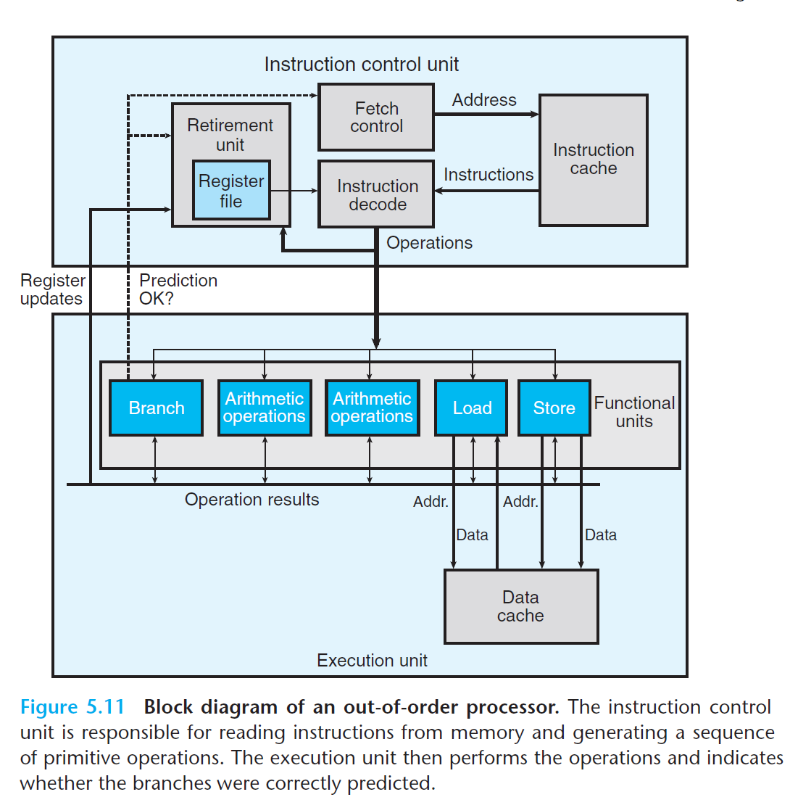
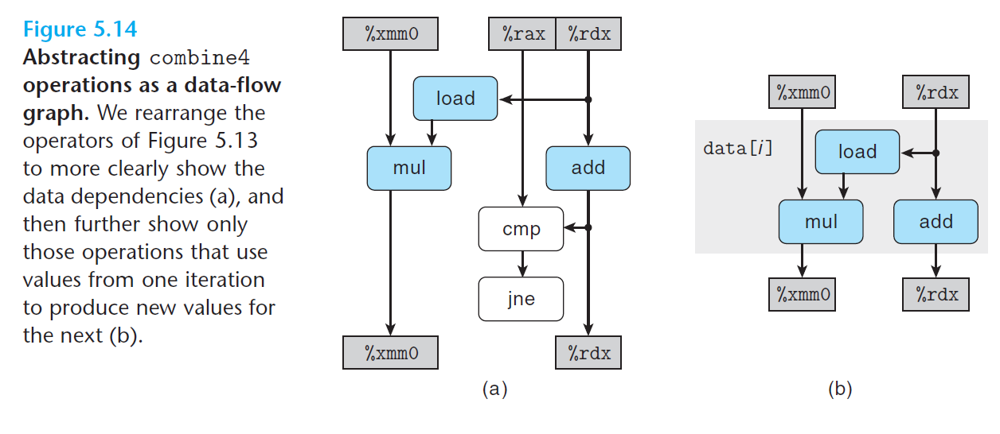
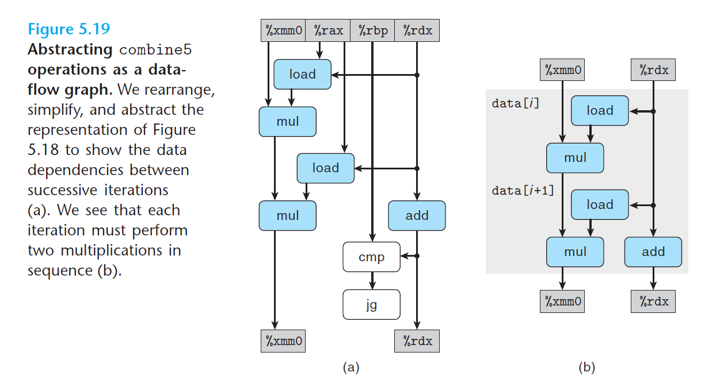
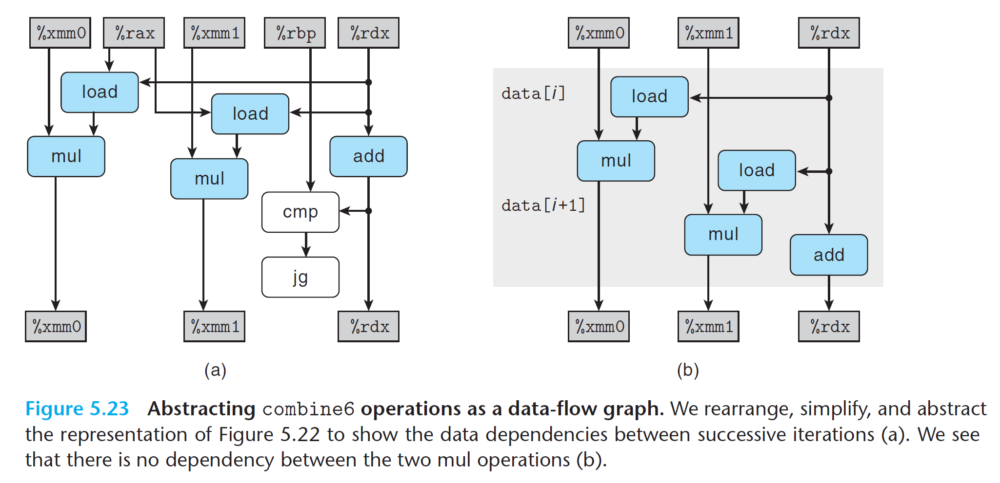
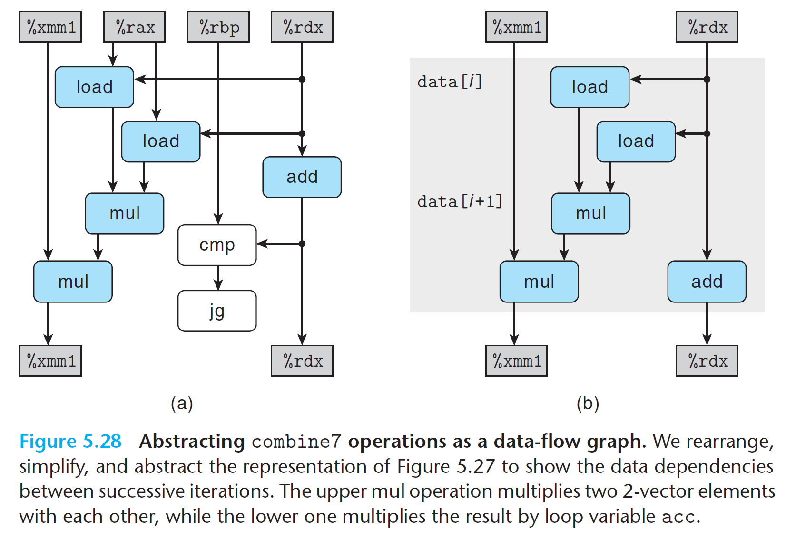
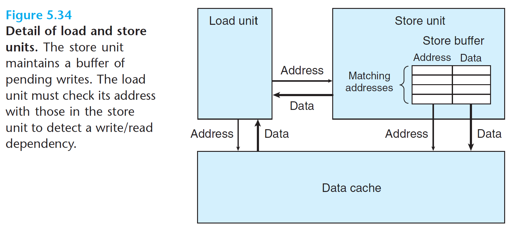
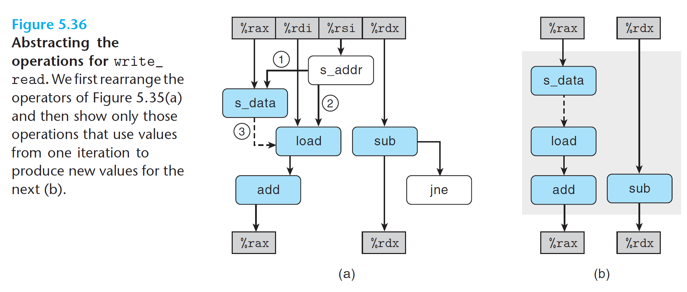

# Optimizing Program Performance

Modern compilers are optimizing compilers that generate efficient machine code. However programmers can write bad code creating optimizing blockers that hinder efficient optimization.

**Summary of Performance Improvement Techniques**
- Basic coding principles:
  - Eliminate excessive function calls. Move (repeated) computations out of loops if possible. Consider comprising program modularity to increase efficiency (no need dedicated function)
  - Eliminate unnecessary memory references. Introduce temporary variables to hold intermediate results, so no need read/write from memory very slow. Store result in global variable only after final value computed.
- Low-level optimizations:
  - Unroll loops to reduce overhead and to enable further optimizations.
  - Find ways to increase instruction-level parallelism, using multiple accumulators or reassociation etc
  - Rewrite condition operations in a functional style to enable compilation via conditional data transfers.

## Vector Example

We implement the vector ADT to illustrate some optimizations:

```c
/* Create abstract data type for vector */
typedef struct {
    long len;
    data_t *data;
} vec_rec, *vec_ptr; 
//declares two types, the structure type itself and a pointer type pointing to the struct
```

Generic operation involving vectors (inefficient):
```c
//identity value for the operation, 0 for add and 1 for divide
#define IDENT 0;
#define OP +;

//dest is a pointer to where final result is stored
void combine1(vec_ptr v, data_t* dest) {
    long i;
    *dest = IDENT;
    for (i = 0; i < vec_length(v); i++) {
        //temp variable use to store each element
        data_t val;
        get_vec_element(v, i, &val);
        *dest = *dest OP val;
    }
}
```

### Eliminating Loop Inefficiencies

Observe that `combine1` calls function `vec_length` as the test condition of the `for` loop, called every loop! The length of the vector does not change as the loop proceeds. We could therefore compute the vector length only **once**  and use this value in our test condition:

```c
void combine2(vec_ptr v, data_t* dest) {
    long i;
    //taken out of loop and computed onlu once
    long length = vec_length(v);
    *dest = IDENT;
    for (i = 0; i < length; i++) {
        data_t val;
        get_vec_element(v, i, &val);
        *dest = *dest OP val;
    }
}
```

*Code motion* is a type of optimization which identifies computation that is performed multiple times, but has the same result. We therefore move this computation out of the loop.

### Reducing Procedure Calls

In the code for `combine2`, the `get_vec_element` is called on every loop iteration to retrieve the next vector element. In `get_vec_element`, the function checks the vector index `i` against the loop bounds in every loop, a clear source of inefficiency. (Bounds checking might be a useful feature when dealing with arbitrary array accesses, but a simple analysis of the code for `combine2` shows that all references will be valid).

We remove function calls in the inner loop:
```c
data_t *get_vec_start(vec_ptr v) {
    return v->data;
}

void combine3(vec_ptr v, data_t *dest) {
    long i;
    long length = vec_length(v);
    data_t *data = get_vec_start(v);

    *dest = IDENT;
    for (i = 0; i < length; i++) {
        //access array directly instead of unncessary function calls
        *dest = *dest OP data[i];
    }
}
```

### Eliminating Unneeded Memory References

For `data_t` as `double` and with multiplication `*` as the `OP` , the x86-64 code of inner loop of `combine3`:

```nasm
; dest in %rbx, data+i in %rdx, data+length in %rax
.L17
  vmovsd (%rdx), %xmm0            ; read product from dest
  vmulsd (%rdx), %xmm0, %xmm0     ; multiply product by data[i]
  vmovsd %xmm0, (%rbx)            ; store result at dest
  addq   $8, %rdx ; increment data to read next elem
  cmpq   %rax, %rdx ;compare to data+length
  jne    .L17 ;if !=, then go to loop
```

The accumulated value is read from and written to memory on each iteration. This reading and writing to `dest` is wasteful. We eliminate unneccessary reading and writing of memory in `combine4`:

```c
void combine4(vec_ptr v, data_t *dest) {
    long i;
    long length = vec_length(v);
    data_t *data = gec_vec_start(v);
    data_t acc = IDENT;

    for (i = 0; i < length; i++) {
        //introduce a temp local variable that accumulates
        acc = acc OP data[i];
    }
    //result is stored in dest only after the loop completes
    *dest = acc;
}
```

The assembly code that follows show:

```nasm
.L25
  vmulsd (%rdx), %xmm0, %xmm0 ;multiply acc by data[i]
  addq   $8, %rdx ;increment data
  cmpq   %rax, %rdx ;compare
  jne    .L25 ;if !=, goto loop
```

Significant overhead in reading and writing!

## Understanding Modern Processors

Actual operation of processors is far different from the view that is perceived by looking at machine-level programs.

At **code level**, ite appears as if instructions are executed one at a time, where each instructions involves fetching values from registers or memory, performing an operation, and storing results back to a register or memory location. In the actual processor, a number of instructions are evaluated simultaneously, referred to as **instruction-level parallelism**.

- *latency bound*: a series of operations must be performed in strict sequence, because the result of one operation is required before the next one can begin.
  - minimum value for the CPE for any function that must perform the combining operation in a strict sequence
- *throughput bound*: characterizes the raw computing capacity of the processor's functional units.
  - minimum bound for the CPE based on the maximum rate at which the functional units can produce results.

### Overall Operation



- ICU: instruction control unit, which is responsible for reading a sequence of instructions from memory and generating from theses a set of primitive operations to perform on program data.
- CU: execution unit, which then executes theses operations.

The ICU reads the instructions from an **instruction cache** — a special high-speed memory containing the most recently accessed instruction. In general, the ICU fetches well ahead of the currently executing instructions, so that it has enough time to decode these and send operations down to the EU.

One problem, is that when a program hits a branch, there are two possible directions the program might go. Modern processors employ a technique known as **branch prediction**, in which they guess whether or not a branch will be taken and also predict the target address for the branch. If it later determines that the branch was predicted incorrectly, it resets the state to that at the branch point and begins fetching and executing instructions in the other direction (very costly)

## Functional Unit Performance

- latency: total time required to perform the operation.
- issue time: minimum number of clock cycles between two independent operations of the same type.
- capacity: number of functional units capable of performing that operation.

Computing the product or sum of $n$ elements requires around $L * n + K$ clock cycles, where $L$ is the latency of the combining operation and $K$ represents the overhead of calling the function and initiating and terminating the loop. The *cycles per element (CPE)* is therefore equal to the latency bound $L$.

An issue time of 1, means that on each clock cycle, the processor can start a new one of these operations. Short issue time achieved via pipelining. A pipelined function unit is implemented as a series of stages, each of which performs part of the operation. The arithmetic operations can proceed through the stages in close succession rather than waiting for one operation to complete before the next begins. This capability can be exploited only if there are successive, logically independent operations to be performed. Functional units with issue times of 1 cycle are said to be *fully pipelined*: they can start a new operation every clock cycle.

## From Machine-Level Code to Data-Flow Graphs

Assembly code for `combine4`:
```nasm
; Inner loop of combine4, data_t = double, OP = *
; acc in %xmm0, data + i in %rdx, data + length in %rax.
.L25
  vmulsd (%rdx), %xmm0, %xmm0 ;multiply  acc by data[i]
  addq   $8, %rdx ;increment data+i
  cmpq   %rax, %rdx ;compare to data+length
  jne    .L25 ;if !=, goto loop
```

The graphical representation of inner-loop code for `combine4`:



The blue blocks indicates chain of depencies between loop registers, and we can further abstract the data flow to Figure 5.14(b)

## Loop Unrolling

Loop unrolling is a program transformation that reduces the number of iterations for a loop by increasing the number of elements computed on each iteration.

1. it reduces the number of operations that do not contribute directly to the program result, such as loop indexing and conditional branching.
2. it exposes ways in which we can further transform the code to reduce the number of operations in the critical paths of the overall computation.

For example:

```c
// 2 * 1 loop unrolling
void combine5(vec_ptr v, data_t *dest) {
    long i;
    long length = vec_length(v);
    long limit = length - 1;

    data_t *data = get_vec_start(v);
    data_t acc = IDENT;
    // combine 2 elements at a time
    for (i = 0; i < limit; i += 2) {
        acc = (acc OP data[i]) OP data[i+1];
    }
    // Finish any remaining elements
    for(; i< length; i++) {
        acc = acc OP data[i];
    }
    *dest = acc;
}
```

The machine-code:

```nasm
; Inner loop of combine5. data_t = double, OP = *
; i in %rdx, data %rax, limit in %rbp, acc in %xmm0
.L35:
  vmulsd (%rax, %rdx, 8). %xmm0, %xmm0 ;multiply acc by data[i]
  vmulsd 8(%rax, %rdx, 8). %xmm0, %xmm0 ;multiply acc by data[i+1]
  addq $2, %rdx ;increment i by 2
  cmpq %rdx, %rbp ;check if reach end
  jg .L35 ;loop if neccessary
```



## Enhancing Parallelism

### Multiple Accumulators

Applying 2 * 2 loop unrolling (applying both two-way loop unrolling to combine more elements per iteration, and two-way parallelism to accumulate odd indice element one stream and even indices another stream):

```c
void combine6(vec_ptr v, data_t *dest) {
    long i;
    long length = vec_length(v);
    long limit = length - 1;

    data_t *data = get_vec_start(v);
    data_t acc0 = IDENT;
    data_t acc1 = IDENT;

    for (i = 0; i < limit; i += 2) {
        //combine two elements at a time
        acc0 = acc OP data[i];
        acc1 = acc1 OP data[i+1];
    }

    for (; i < length; i++) {
        acc0 = acc0 OP data[i];
    }

    *dest = acc0 OP acc1;
}
```



We can generalize the multiple accumulator transformation to unroll the loop by a factor of $k$ and accumulate $k$ values in parallel, yielding $k × k$ loop unrolling.

### Reassociation Transformation

Changed the elements are combined in the inner loop:

```c
acc = acc OP (data[i] OP data[i+1]);
```

so, the `combine7` is:

```c
// 2 * 1a loop unrolling
void combine7(vec_ptr v, data_t *dest) {
    long i;
    long length = vec_length(v);
    long limit = length - 1;

    data_t *data = get_vec_start(v);
    data_t acc = IDENT;
    // combine 2 elements at a time
    for (i = 0; i < limit; i += 2) {
        acc = acc OP (data[i] OP data[i+1]);
    }
    // Finish any remaining elements
    for(; i< length; i++) {
        acc = acc OP data[i];
    }
    *dest = acc;
}
```



In both `combine6` and `combine7`, we have two load and two mul operations, but for `combine7` only one of the mul operations forms a data-dependency chain between loop registers. The first multiplication within each iteration can be performed without waiting for the accumulated value from the previous iteration; previousl both `mul` had to wait for previous operations. Thus, we reduce the minimum possible CPE. Reduce dependencies between register loops.

A reassociation transformation can reduce the number of operations along the critical path in a computation, resulting in better performance by better utilizing the multiple functional units and their pipelining capabilities.

## Understanding Memory Performance

All processors contain cache memories to provide fast access to small amounts of memory; we consider loading and storing to these caches

### Load Performance

Load operations (reading from memory to register) depends on both the pipelining capability and the latency of the load unit. Be careful of sequential operations dependent on previous operations

### Store Performance

Store operations (writing register value to memory) can operate in fully pipelined mode, and there are no data dependencies between stores. Stores do not affect any register values. Only loads are affected by prior stores.

```c
/* Write to dest, read from src */
void write_read(long *src, long *dst, long n) {
    long cnt = n;
    long val = 0;
    while (cnt) {
        //store to dest first
        *dst = val;
        //load data from source, add 1, and move it to val
        val = (*src)+1;
        cnt--;
    }
}
```

If `src` and `dst` point to different objects, then the result of the read from `src` is not affected by the write to `dst`. Operations are independent.

However, if both `src` and `dst` point to the same object, each load by the pointer reference `*src` will
yield the value stored by the previous execution of the pointer reference `*dest`. There is a *write/read dependency* here - the outcome of a memory read depends on a recent memory write. Causes slowdown of around 6 clock cycles.



The store unit includes a store buffer containing the addresses and data of the store operations that have been issued, but have not yet been completed, where completion involves updating the data cache. This buffer is provided so that a series of store operations can be executed without having to wait for each one to update the cache. When a load operation occurs, it must check the entries in the store buffer for matching addresses. If it finds a match (meaning that any of the bytes being written have the
same address as any of the bytes being read), it retrieves the corresponding data entry as the result of the load operation.

```nasm
; Inner loop of write_read
; src in %rdi, dst in %rsi, val in %rax
.L3:               
    ;this write code involves two operations
    ;s_addr computes the address for store operation, creates entry in the store buffer, and sets the address field for that entry
    ;s_data sets the data field for that entry
    ;these operations can be performed independently, so separate functional units can do pipelining
    movq    %rax, (%rsi)          ; Write val to dst

    movq    (%rdi), %rax          ; t = *src
    addq    $1, %rax              ; val = t+1
    subq    $1, %rdx              ; cnt--
    jne     .L3                   ; If !=0, goto loop
```



There is a conditional dependency between `s_data` and `load`. Before

- Relationship “1” represents the requirement that the store address must be computed before the data can be stored.
- Relationship “2” represents the need for the load operation to compare its address with that for any pending store operations to check for conflicts
- Relationship “3” represents the conditional data dependency that arises when the load and store addresses match
  - If two addresses match, `load` must wait until `s_data` has deposited its result into the store buffer
  - If the two addresses differ, then `load` and `s_data` can proceed independently

We can see the dependency between `s_data` and `load` causes a critical path to form, requiring more clock cycles. With operations on registers, the processor can determine which instructions will affect which others as they are being decoded into operations. With memory operations, on the other hand, the processor cannot predict which will affect which others until the load and store addresses have been computed. Efficient handling of memory operations is critical.

> Use profilers like Pytorch Profiler to identify performance bottlenecks in data pipelines and resource utilization patterns