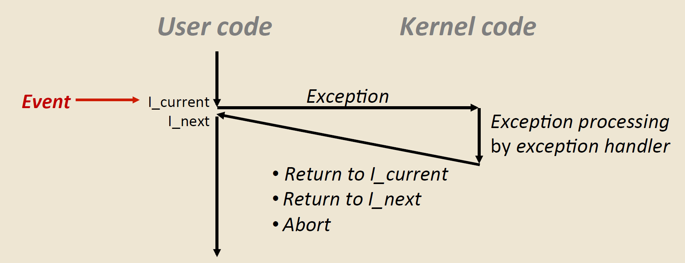
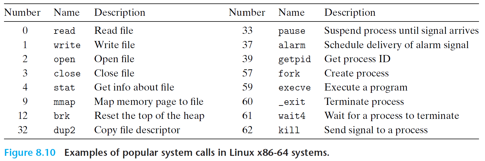
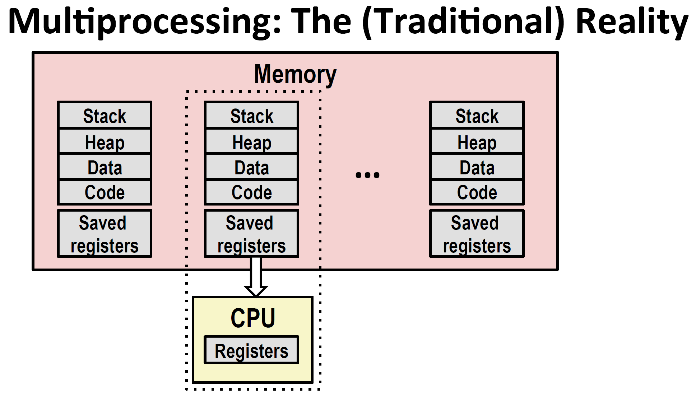
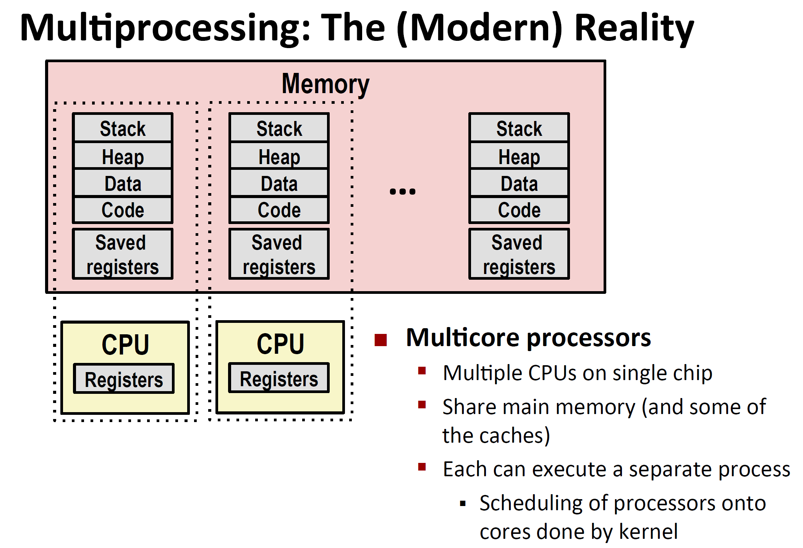
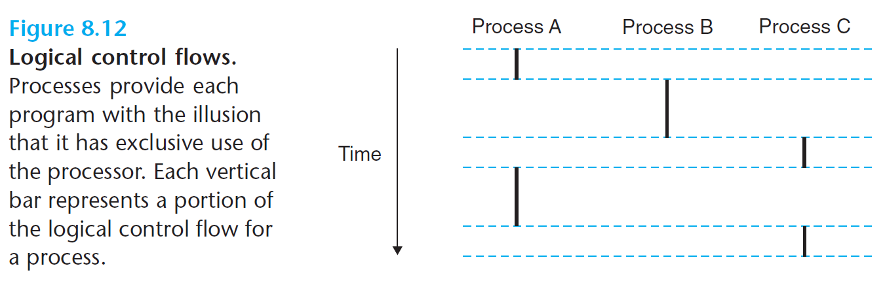
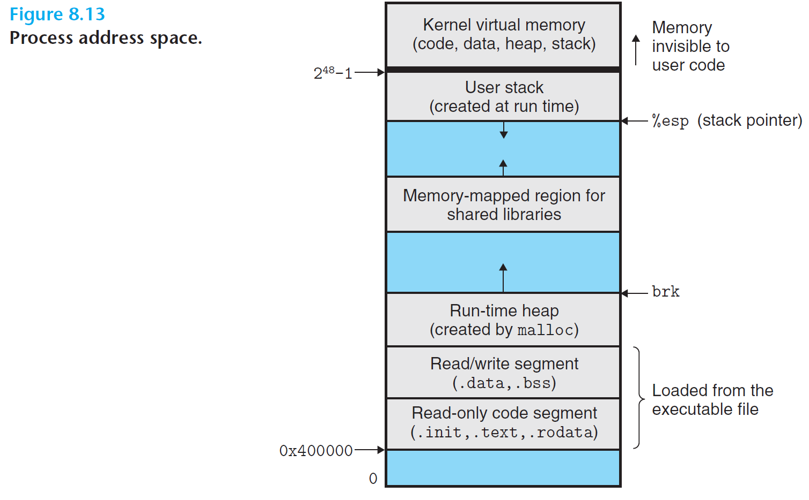
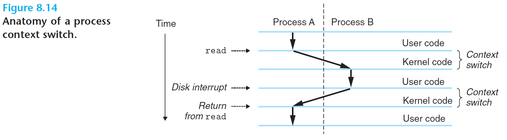
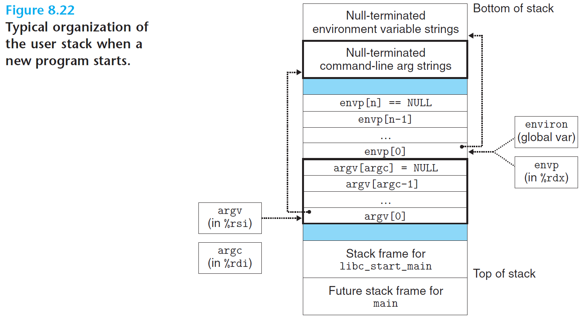
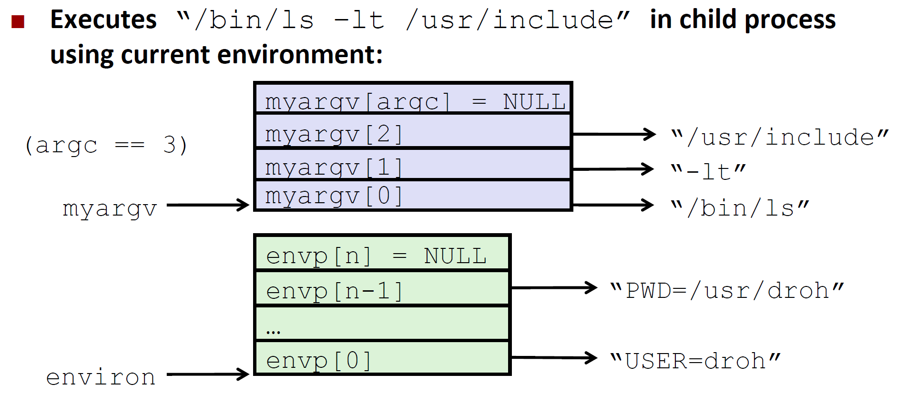

# Exceptional Control Flow: Exceptions and Processes

**Exceptional Control Flow (ECF)** refers to abrupt changes in the control flow that occur in response to changes in *system state*, not just *program state* (jumps and branches, call and return only react to program state)

## Exceptions

An **exception** is an transfer of control to the *OS kernel* in response to some event (e.g. divide by 0, arithmetic overflow, typing ctrl-C)



Each exception type has a unique **exception number `k`**. The OS maintains an **exception table** where entry `k` contains the address of the handler for exception `k`.

```
| Exception Table Entry | Handler Address/Code |
|----------------------|---------------------|
| 0 | → Code for exception handler 0 |
| 1 | → Code for exception handler 1 |
| ... | ... |
| n-1 | → Code for exception handler n-1 |
```

When an exception occurs:
1. Processor determines exception number `k` and makes indirect procedure call through exception table to handler
2. Handler processes the event
3. Returns control to `l_current`, `l_next` or `abort`

### Classes of Exceptions

| Class | Cause | Async/Sync | Return Behavior |
|-------|-------|------------|-----------------|
| **Interrupt** | Signal from I/O device | Async | Always returns to next instruction |
| **Trap** | Intentional exception | Sync | Always returns to next instruction |
| **Fault** | Potentially recoverable error | Sync | Might return to current instruction |
| **Abort** | Nonrecoverable error | Sync | Never returns |

#### Asynchronous Exceptions
**Interrupts**
  - Caused by events external to processor (e.g. timer interrupt, or ctrl-C from keyboard)
  - Asynchronous - not caused by executing current instruction
  - Handler returns to next instruction

#### Synchronous Exceptions
- Caused by events due to executing an instruction

**Traps**
  - Intentional exceptions (e.g. system calls etc)
  - Returns control to `l_next` next instruction

**Faults**
  - Unintentional but possibly recoverable (e.g. page faults, floating point exceptions)
  - Either re-executes `l_current` or aborts

*Page Faults* are when a program tries to access a memory page that isn't currently loaded in physical RAM (may be on disk etc), and needs to load page from disk to RAM. *Segmentation fault* is when a program tries to access memory it does not have permission to access (e.g. array out of bounds), this will crash the program.

**Aborts**
  - Unintentional and not recoverable (e.g. illegal instruction, machine check)
  - Aborts current program

### System Calls



Traps are most importantly used in system calls, which are an interface between user programs and OS kernel. User programs often need to request services from the kernel such as reading a file (read), creating a new process (fork), loading a new program (execve), and terminating the current process (exit).

To allow controlled access to such kernel services, processors provide a special `syscall n` instruction that user programs can execute when they want to request service `n`. Executing the syscall instruction causes a trap to an exception handler that decodes the argument and calls the appropriate kernel routine.

```c
// System call example. First arg sends output to stdout
// second arg is the sequence of bytes, and third arg gives the number of bytes to write
write(1, "hello, world\n", 13);
```

## Processes

A **process** is an *instance* of a running program. Processes provide two key abstractions:

1. **Logical control flow**: Each program appears to have exclusive use of CPU. Provided by kernel mechanism called *context switching*
    - The context consists of whole state that the program needs to run. Includes the program’s code and data stored in memory, its stack, the contents of its general purpose registers, its program counter, environment variables, and the set of open file descriptors

2. **Private virtual address space**: Each program appears to have exclusive use of memory. Provided by kernel mechanism called *virtual memory*

> Note that each thread in a process has its own independent control flow. If a process spawns multiple threads, they all share the same private address space (virtual address space)!

#### Multiprocessing

This allows us to give the illusion of multiprocessing, where multiple processes run concurrently



Traditionally, The CPU loads and writes to saved registers and switches the address space, via context switching.



In modern times, there are multiple CPUs on a single chip, and these all share the same main memory and each core can execute a separate process.

### Logical Control Flow

Each process executes a sequence of program counter values called a **logical flow**. The processor's physical control flow is partitioned among multiple logical flows through **multitasking** or **time slicing**.

### Concurrent Flows



- **Concurrent flows**: Concurrent flows are when execution overlaps in time (e.g. process A and B). Otherwise, the flows are sequential (e.g. process B and C) 
  - Flows X and Y are concurrent IFF X begins after Y begins and before Y finishes, or vice versa
- **Parallel flows**: Concurrent flows running on *different processor cores*

### Private Address Space

Each process has its own private virtual address space with the same general organization:



- User portion: code, data, heap, stack
- Kernel portion: OS code and data (accessible only in kernel mode)

### User and Kernel Modes

- **User mode**: Restricted privileges, cannot execute privileged instructions
- **Kernel mode**: Can execute any instruction, access any memory location
- Mode controlled by a mode bit in processor control register
- Transition from user to kernel mode only via exceptions

### Context Switches

The kernel implements multitasking (or multiprocessing) via **context switches**:



1. Process A runs some user code
2. Process A initiates a system call `read` to disk, which takes some time. So control passed to trap handler in the kernel, where kernel does context switching to process B
3. Runs Process B in user mode
4. Once disk sends a signal that the data transfer from disk to memory is done
5. Kernel does context switching back to Process A to continue

> **Context** includes registers, PC, user stack, status registers, kernel stack, page table, process table, file table.

## Process Control

### System Call Error Handling

On error, linux system-level functions typically return `-1` and set the global variable `errno` to indicate the cause of error. Do check the return status of every system level function!

```c
if ((pid = fork()) < 0) {
    fprintf(stderr, "fork error: %s\n", strerror(errno));
    exit(0);
}
```

### Process States

Use `pid_t getpid(void);` to get the Process ID (PID) of calling process. Use `pid_t getppid(void);` to get PID of parent process.

Processes can be in 3 states:

- **Running**: Executing or waiting to be scheduled, and will eventually by scheduled (chosen to execute) by kernel
- **Stopped**: Execution suspended, and will not be scheduled until a signal
- **Terminated**: Stopped permanently

### Terminating Processes

```c
void exit(int status);
```

The `exit` function terminates the process with a exit status of `status`.

> This function is called once and does not return!

### Creating Processes (Fork)

A *parent process* creates a new running *child process* through the `fork` function

```c
pid_t fork(void);      // Create new process
// Returns: If called in child returns 0, If called in parent return PID of child, -1 on error
```

The child process gets an identical copy (independent copy) of parent's virtual address space, open file descriptors etc, but has a *different PID* from parent.

> `fork` is called once but returns twice!

```c
int main() {
    pid_t pid;
    int x = 1;
    
    pid = fork();
    if (pid == 0) {        /* Child increments x */
        printf("child: x=%d\n", ++x);
    } else {               /* Parent decrements x */
        printf("parent: x=%d\n", --x);
    }
    exit(0);
}
```

will return

```
linux> ./fork
parent: x=0
child : x=2
```

- **Concurrent execution** - parent and child run concurrently
  - This means you can't predict the execution order of parent and child!
- **Duplicate but separate address spaces**
  - `x` has separate values in both processes
- **Shared files** - child inherits parent's open file descriptors


### Reaping Child Processes

When a process terminates, it becomes a **zombie** until reaped by its parent (hence deleted by kernel). In zombie state, it still consumes system resources, and must be reaped by parent to be completely deleted. The reaping is done using `wait`

If parent process terminates while children are not, the `init` process (PID 1) adopts orphaned children. The `init` process is the ancestor of every process, and is created during system start up, and never terminates.

```c
#include <sys/wait.h>

//waitpid suspends execution of the calling process, until that child process is terminated
pid_t waitpid(pid_t pid, int *statusp, int options);
// Returns: PID of child if OK, 0 (if WNOHANG), or -1 on error

//wait until any child process is terminated
pid_t wait(int *statusp);  // Equivalent to waitpid(-1, statusp, 0)
```

### Loading and Running Programs

```c
#include <unistd.h>
// argument list argv and environment variable list envp
int execve(const char *filename, const char *argv[], const char *envp[]);
// Does not return if OK; returns -1 on error
// Called once and never returns!
```

`execve` loads and runs a new program in the context of the *current process*:
- Overwrites code, data, and stack
- Keeps PID, open files, and signal context
- Does not create new process (unlike fork)

Argument list:
```
argv[]
├── argv[0] → "ls"
├── argv[1] → "-lt"
├── ⋮
├── argv[argc-1] → "/user/include"
└── NULL
```

Environment variable list

```
envp[]
├── envp[0] → "PWD=/usr/droh"
├── envp[1] → "PRINTER=iron"
├── ⋮
├── envp[n-1] → "USER=droh"
└── NULL
```



Example:




```c
if ((pid = Fork()) == 0) { /* Child runs program */
    if (execve(myargv[0], myargv, environ) < 0) {
            printf("%s: Command not found.\n", myargv[0]); 
            exit(1); 
    }
}
```


## Shell Example

A simple shell demonstrates fork and execve usage:

```c
/* $begin shellmain */
#include "csapp.h"
#define MAXARGS   128

/* Function prototypes */
void eval(char *cmdline);
int parseline(char *buf, char **argv);
int builtin_command(char **argv); 

int main() 
{
    char cmdline[MAXLINE]; /* Command line */

    while (1) {
	/* Read */
	printf("> ");                   
	Fgets(cmdline, MAXLINE, stdin); 
	if (feof(stdin))
	    exit(0);

	/* Evaluate */
	eval(cmdline);
    } 
}
/* $end shellmain */
  
/* $begin eval */
/* eval - Evaluate a command line */
void eval(char *cmdline) 
{
    char *argv[MAXARGS]; /* Argument list execve() */
    char buf[MAXLINE];   /* Holds modified command line */
    int bg;              /* Should the job run in bg or fg? */
    pid_t pid;           /* Process id */
    
    strcpy(buf, cmdline);
    bg = parseline(buf, argv); 
    if (argv[0] == NULL)  
	return;   /* Ignore empty lines */

    if (!builtin_command(argv)) { 
        if ((pid = Fork()) == 0) {   /* Child runs user job */
            if (execve(argv[0], argv, environ) < 0) {
                printf("%s: Command not found.\n", argv[0]);
                exit(0);
            }
        }

	/* Parent waits for foreground job to terminate */
	if (!bg) {
	    int status;
	    if (waitpid(pid, &status, 0) < 0)
		unix_error("waitfg: waitpid error");
	}
	else
	    printf("%d %s", pid, cmdline);
    }
    return;
}

/* If first arg is a builtin command, run it and return true */
int builtin_command(char **argv) 
{
    if (!strcmp(argv[0], "quit")) /* quit command */
	exit(0);  
    if (!strcmp(argv[0], "&"))    /* Ignore singleton & */
	return 1;
    return 0;                     /* Not a builtin command */
}
/* $end eval */

/* $begin parseline */
/* parseline - Parse the command line and build the argv array */
int parseline(char *buf, char **argv) 
{
    char *delim;         /* Points to first space delimiter */
    int argc;            /* Number of args */
    int bg;              /* Background job? */

    buf[strlen(buf)-1] = ' ';  /* Replace trailing '\n' with space */
    while (*buf && (*buf == ' ')) /* Ignore leading spaces */
	buf++;

    /* Build the argv list */
    argc = 0;
    while ((delim = strchr(buf, ' '))) {
	argv[argc++] = buf;
	*delim = '\0';
	buf = delim + 1;
	while (*buf && (*buf == ' ')) /* Ignore spaces */
            buf++;
    }
    argv[argc] = NULL;
    
    if (argc == 0)  /* Ignore blank line */
	return 1;

    /* Should the job run in the background? */
    if ((bg = (*argv[argc-1] == '&')) != 0)
	argv[--argc] = NULL;

    return bg;
}
/* $end parseline */

```