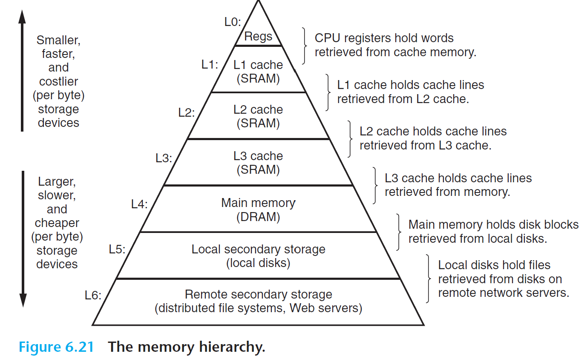
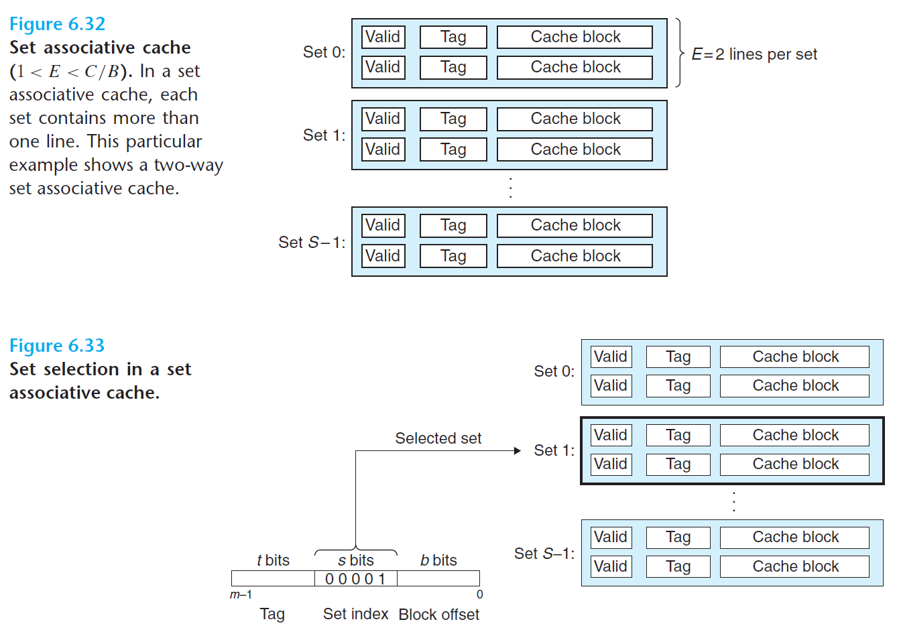

# The Memory Hierarchy

In practice, a **memory system** is a hierarchy of storage devices with different capacities, costs, and access times.

- CPU registers hold the most frequently used data.
- Small, fast *cache memories* nearby the CPU act as staging areas for a subset of the data and instructions stored in the relatively slow main memory.
- The main memory stages data stored on large, slow disks, which in turn often serve as staging areas for data stored on the disks or tapes of other machines connected by networks.

This idea center around a fundamental property of computer programs known as **locality**
- Well-written programs tend ot access storage at a particular level more frequently than storage at the next lower level
- Storage at the next level can afford to be slower and larger


## Storage Technologies

### Random Access Memory (RAM)

RAM comes in 2 categories - static (SRAM) and dynamic (DRAM).

| | Transistors per bit | Relative access time | Persistent | Sensitive | Relative cost | Applications |
| - | - | - | - | - | - | - |
| SRAM | 6 | 1x | yes | no | 1000x  | Cache memory |
| DRAM | 1 | 10x | no | yes | 1x | Main memory, frame buffers|

SRAM is faster and significantly more expensive than DRAM. SRAM often used for cache memories, on and off CPU. DRAM used for main memory and frame buffers. Usually few tens of megabytes of SRAM, but thousands of megabytes of DRAM. SRAM is persistent as long as power is applied. Unlike DRAM, no refresh is necessary. SRAM can be accessed faster than DRAM. SRAM is not sensitive to disturbances such as light and electrical noise. The trade-off is that SRAM cells use more transistors than DRAM cells and thus have lower densities, are more expensive, and consume more power.

### Nonvolatile Memory

DRAM and SRAM are volatile in the sense that they lose their information when supply voltage is turned off. Nonvolatile memory retain their information even when powered off, referred to as Read-Only Memories (ROM). ROMs are distinguished by number of times they can be written to, and mechanism for writing to.

- Read-only memory (ROM): programmed during production
- Programmable ROM (PROM): can be programmed once
- Eraseable PROM (EPROM): can be bulk erased (UV, X-Ray)
- Electrically eraseable PROM (EEPROM): electronic erase capability
- Flash memory: EEPROMs. with partial (block-level) erase capability. Wears out after about 100,000 erasings

Programs stored in ROM devices are called firmware. When computer powers up, it runs firmware stored in ROM. Some systems with small set of primitive input/output functions in firmware - like a PC's BIOS (basic input/output system) routines.

### Accessing Main Memory

Data flows back and forth between the CPU and the DRAM main memory over shared electrical conduits called buses. Each transfer called a bus transaction. A read transaction transfers data from main memory to CPU. A write transaction transfers data from CPU to main memory. A *bus* is a collection of parallel wires that carry address, data and control signals.


- System bus connects CPU to the I/O bridge
- Memory bus connects I/O bridge to the main memory
- I/O bridge translates electrical signals of system bus to signals of memory bus

Consider what happens with a load operation `movq A, %rax` occurs:


- Circuitry on the CPU called bus interface initiates a read transaction
  - CPU places address A on system bus, I/O bridge passes signal to memory bus
  - Main memory senses address signal on memory bus, fetches data from DRAM, and writes data to memory bus
  - I/O bridge translates memory bus signal to system bus signal and passes it to system bus
  - CPU senses data on system bus, reads data, and copies it to register `%rax`

## Disk Storage

Disks are workhouse storage devices that hold enormous amounts of data, much more than DRAM/SRAM. However, much slower than DRAM/SRAM.

### Connecting I/O Devices

I/O devices (graphics cards, mice etc) are connected to the CPU and main memory via I/O bus. Unlike the system bus and memory buses which are CPU-specific, I/O buses are independent of CPU design.


I/O bus is slower than system and memory buses, but accomodate many third party I/O devices.

### Accessing Disks


1. Memory Mapped I/O
  - A block of addresses in address space reserved for communicating for I/O devices, called I/O port
  - Disk read will execute three store instructions
    - Command to initiate disk read
    - Logical block number in disk to read
    - Main memory address where contents of disk address is to be stored

2. Direct Memory Access (DMA)
  - Disk controller (without involvement of CPU) reads content of disk sector and transfers contents directly to main memory (DMA transfer)

3. Interrupt Signal
  - Disk controller notifies CPU by sending interrupt signal and returns control to CPU

### Solid State Disks


SSD is a storage technology based on flash memory, alternative to a conventional rotating disk. A flash translation layer is a hardware/firmware interface that translates requests for logical blocks to accesses of the physical storage.

SSDs are much faster reading than writing. Thye are built of semiconductor memory, with no moving parts, have much faster random access times than rotating disks, and use less power. However the flask blocks wear out after repeated writes, but in practice the lifespan is many years.

### Storage Trends

Gap between DRAM, disk and CPU performance is widening - CPU improves much faster. Before, this performance gap was a function of latency, with DRAM and disk access times decreasing more slowly than cycle time of a single processor. However, with the introduction of multiple cores, the performance gap is increasingly a function of throughput, with multiple processor cores issuing requests to DRAM/disk in parallel. Modern computers use SRAM caches to bridge memory-processor gap.

## Locality

*Principle of Locality*:  Programs tend to use data and instructions with addresses near or equal to those they have used recently.
- *Temporal Locality*: A memory location that is referenced once is likely to be referenced again multiple times in the near future
- *Spatial Locality* When a memory locaiton is referenced once, program likely to reference nearby memory locations in the near future

Hardware - cache memories hold blocks of most recently referenced instructions and data. OS - system uses main memory as cache of most recently referenced chunks in virtual address space.

### Locality of References to Program Data

Note that sequential reference patterns visits each element of a vector sequentially. A *stride-k reference pattern* visits every *kth* element of a contiguous vector. As the stride increases, the spatial locality decreases.

Stride is important for multipledimensional arrays:

```c
int sumarrayrows(int a[M][N])
{
    int i, j, sum = 0;
    //reads in row major order, good stride-1 reference pattern
    for (i = 0; i < M; i++)
        for (j = 0; j < N; j++)
            sum += a[i][j];
    return sum;
}
```

| Address | 0 | 4 | 8 | 12 | 16 | 20 |
|---------|---|---|---|----|----|----| 
| Contents | a₀₀ | a₀₁ | a₀₂ | a₁₀ | a₁₁ | a₁₂ |
| Access order | 1 | 2 | 3 | 4 | 5 | 6 |


```c
int sumarraycols(int a[M][N])
{
    int i, j, sum = 0;
    //poor spatial locality, as it scans memory with a stride-N reference pattern
    for (j = 0; j < N; j++)
        for (i = 0; i < M; i++)
            sum += a[i][j];
    return sum;
}
```

| Address | 0 | 4 | 8 | 12 | 16 | 20 |
|---------|---|---|---|----|----|----| 
| Contents | a₀₀ | a₀₁ | a₀₂ | a₁₀ | a₁₁ | a₁₂ |
| Access order | 1 | 3 | 5 | 2 | 4 | 6 |

## The Memory Hierarchy



Storage devices get slower, larger and cheaper down the memory hierarchy.


### Caching in Memory Hierarchy


A cache is a staging area for data stored in larger, slower devices. Faster/smaller storage at level *k* serves as cache for slower/larger storage one level down *k+1*. Storage at lvl *k+1* are partitioned into blocks, and a subset of blocks is copied to level *k*. Devices lower down the hierarchy have longer access times, hence needs to use larger block sizes to amortize long access times

**Cache Hits**

When program needs object *d* from level *k+1*, it will first look one level up at level *k*. If object is cached at level *k*, called cache hit. This is faster than reading from level *k+1*.

**Cache Misses**

If object *d* is not cached at level *k*, this a cache miss. The cache at level *k* will fetch block containing *d* from level *k+1*, possibly overwriting a existing block in level *k* if cache is full. THis is called replacing a block, set by the replacement policy.
- Random replacement policy chooses a random victim block
- Least Recently Used (LRU) cache chooses the block that was accessed the furthest in the past

After cache at level *k* has fetched the relevant block from level *k+1*, program can now read *d* from level *k*.

**Cold cache**: empty cache so always miss
**Conflict miss**: Cache large enough to hold referenced objects, but multiple lower level blocks map to the same upper level block, so access to these objects will cause constant misses (block keeps getting overwritten)
**Capacity miss**: The working set is a set of blocks that is currently accessed. If working set size exceeds cache size, cannot hold the entire working set, may result in capacity misses.

**Cache Management** Logic to partition cache into blocks, transfer blocks between different levels, deal with misses and hits.
- Compiler manages register files
- L1/L2/L3 managed by hardware logic
- DRAM main memory is cache for disk, managed by OS and CPU instructions
- For machine with distributed file systems like Andrew File System (AFS), local disk is a cache managed by AFS client process

Exploiting temporal locality: Cache recent objects
Exploiting spatial locality: cache blocks instead of single data objects, so other objects within block, which may be requested often, are easily accessible

## Cache Memories

The memory hierarchies of early computers only consisted 3 levels: CPU registers, main memory, and disk storage. However, due to increasing gap between CPU and main memory, system designers had to insert a small SRAM cache memory (L1 cache) between the CPU registers and main memory.

### Generic Cache Memory Organization


- Each memory address has $m$ bits that form $M=2^m$ unique addresses
- There are $s=2^s$ number of cache sets
- Each set consists of $E$ cache lines
- Each line consists a data *block* of $B=2^b$ bytes
- A single valid bit indicates if the line has meaningful information
- $t=m-(b+s)$ *tag bits* uniquely identify which line is stored in

A cache's organization is characterized by $(S,E,B.m)$ where the cache capacity is $C=S*E*B$.

Suppose we request for data at address $A$:
- The *s* set index bits tell us which set out of $S$ sets the word (byte here) is located in.
- The *t* tag bits tell us which line out of $E$ lines the word is located in
  - A line in the set matches the word if and only if valid bit is set and tag bits in the line matches tag bits in address $A$
- Once we've located the line, then the *b block offset bits* give us the offset of the word in the $B$-byte data block

| Parameter | Description |
|-----------|-------------|
| **Fundamental parameters** | |
| S = 2ˢ | Number of sets |
| E | Number of lines per set |
| B = 2ᵇ | Block size (bytes) |
| m = log₂(M) | Number of physical (main memory) address bits |
| **Derived quantities** | |
| M = 2ᵐ | Maximum number of unique memory addresses |
| s = log₂(S) | Number of set index bits |
| b = log₂(B) | Number of block offset bits |
| t = m - (s + b) | Number of tag bits |
| C = B × E × S | Cache size (bytes), not including overhead such as the valid and tag bits |

Caches are grouped into different classes based on $E$m the number of cache lines per set.

### Direct-Mapped Caches

A cache with exactly one line per set ($E=1$) is known as direct mapped cache.


When a cache checks if a request is a hit/miss and extract the requested word *w*, the process is:

1. Set Selection
   - Extract the *s* set index bits
2. Line-Matching
   - Since there is only one line per set, a copy of *w* is contained in the line if and only if the valid bit is set and the cache line tag matches the tag in the address of *w*
3. Word Selection
   - Use block offset bits to provide us with offset of the *first byte* in the desired word (here, a word is 4 bytes)

> Concatenation

#### Cache Misses

If the cache misses, it needs to retrieve requested block from next level in the memory hierarchy and store the new block in a relevant cache line; here's there's only one choice for the cache line.

#### Example

This example demonstrates how a direct-mapped cache works with the following parameters:
- (S, E, B, m) = (4, 1, 2, 4)
- 4 sets (S = 4)
- 1 line per set (E = 1)
- 2 bytes per block (B = 2)
- 4-bit addresses (m = 4)

| Address (decimal) | Tag bits (t=1) | Index bits (s=2) | Offset bits (b=1) | Block number (decimal) |
|------------------|----------------|------------------|-------------------|----------------------|
| 0                | 0              | 00               | 0                 | 0                    |
| 1                | 0              | 00               | 1                 | 0                    |
| 2                | 0              | 01               | 0                 | 1                    |
| 3                | 0              | 01               | 1                 | 1                    |
| 4                | 0              | 10               | 0                 | 2                    |
| 5                | 0              | 10               | 1                 | 2                    |
| 6                | 0              | 11               | 0                 | 3                    |
| 7                | 0              | 11               | 1                 | 3                    |
| 8                | 1              | 00               | 0                 | 4                    |
| 9                | 1              | 00               | 1                 | 4                    |
| 10               | 1              | 01               | 0                 | 5                    |
| 11               | 1              | 01               | 1                 | 5                    |
| 12               | 1              | 10               | 0                 | 6                    |
| 13               | 1              | 10               | 1                 | 6                    |
| 14               | 1              | 11               | 0                 | 7                    |
| 15               | 1              | 11               | 1                 | 7                    |

> Combination of tag and index bits uniquely identify each block in the memory
> Since there are 8 memory blocks but only 4 cache sets, multiple blocks map to the same cache set; may cause conflict misses
> Blocks mapping to the same cache set are uniquely identified by the tag

**Initial Cache State**

The cache starts empty with all valid bits set to 0:

| Set | Valid | Tag | block[0] | block[1] |
|-----|--------|-----|----------|-----------|
| 0   | 0      |     |          |           |
| 1   | 0      |     |          |           |
| 2   | 0      |     |          |           |
| 3   | 0      |     |          |           |

**1. Read word at address 0**: Since the valid bit for set 0 is 0, this is a cache miss. Will fetch block 0 from lower level cache and store block 0 in set 0. Cache returns `m[0]`, contents of memory location 0.

| Set | Valid | Tag | block[0] | block[1] |
|-----|--------|-----|----------|-----------|
| 0   | 1      | 0   | m[0]     | m[1]      |
| 1   | 0      |     |          |           |
| 2   | 0      |     |          |           |
| 3   | 0      |     |          |           |

**2. Read word at address 1**: Cache hit. Cache immediately returns `m[1]`

**3. Read word at address 13**: Cache line in set 2 not valid, so cache miss. Cache loads block 6 into set 2 and returns `m[13]`

| Set | Valid | Tag | block[0] | block[1] |
|-----|--------|-----|----------|-----------|
| 0   | 1      | 0   | m[0]     | m[1]      |
| 1   | 0      |     |          |           |
| 2   | 1      | 1   | m[12]    | m[13]     |
| 3   | 0      |     |          |           |

**4. Read word at address 8**: Conflict cache miss. While the cache line in set 0 is valid, tag don't match. Cache loads block 4 into set 0 and returns `m[8]`

| Set | Valid | Tag | block[0] | block[1] |
|-----|--------|-----|----------|-----------|
| 0   | 1      | 1   | m[8]     | m[9]      |
| 1   | 0      |     |          |           |
| 2   | 1      | 1   | m[12]    | m[13]     |
| 3   | 0      |     |          |           |

**5.Read word at address 0**: Another conflict cache miss. We just replaced block 0 with block 4, but we need block 4 again; both blocks maps to the same set.

| Set | Valid | Tag | block[0] | block[1] |
|-----|--------|-----|----------|-----------|
| 0   | 1      | 1   | m[0]     | m[1]      |
| 1   | 0      |     |          |           |
| 2   | 1      | 1   | m[12]    | m[13]     |
| 3   | 0      |     |          |           |

> Thrashing describes a situation where cache is repeatedly loading and evicting the same sets of cache blocks, thrash back and forth between loading and evicting
> Can add padding to change the address such that the blocks no longer map to the same sets

### Set Associative Caches

A set associative cache has each set holding more than one cache line, where $1<E<c/B$



1. Set Selection
2. Line Matching and Word Selection


Cache must search each line in the set for a valid line whose tag matches the tag in the address

#### Line Replacement

Once cache has retrieved the block, which line should it replace? Simplest replacement policy is to choose the replacement line at random. Least Frequently Used (LFU) will replace the line that has be referenced the fewest times. LRU will replace the line accessed the furthest in the past.

### Writes

Operation of cache for reading is straightforward. For writes, multiple copies of *w* exist and deciding how to update all of them is difficult.

**Write-Hit**
- *Write-through*: write immediately to one level down and skip the current cache level
  - Causes alot of bus traffic
- *Write-back*: Defers update as long as possible by writing the updated block to the lower level only when it is evicted from cache by replacement policy
  - Needs to maintain an additional dirty bit indicating if a block has been modified

**Write-Miss**
- *Write-Allocate*: Loads corresponding block from the next lower level and update current level cache
- *No-Write-Allocate*: Bypasses cache and writes word directly to next lower level

As a programmer, assume write-back, write-allocate caches. Lower levels of memory more likely to use write-back due to large transfer times. Both also exhibit good spatial and temporal locality.

### Real Cache Hierarchy


- A cache that holds instructions only is called i-cache
- A cache holding data only is called d-cache
- A cache holding both is called a unified cache

### Performance Impact of Cache Parameters

Cache performance evaluated with:
- *Miss rate*: $n_{misses}/n_{references}$. Hit rate is 1 - miss_rate
- *Hit Time*: Time to deliver a word in the cache to CPU registers
- *Miss Penalty*: Any additional time required because of a miss

**Cache Size**: 
  - Larger cache increase the hit rate
  - However increase hit time, hence L1 cache (more frequently used) smaller than L2.

**Block Size**:
  - Increase hit rate by exploiting spatial locality
  - For a given cache size, larger blocks means less cache lines, hurt hit rate due to poor temporal locality
  - Larger miss penalty as larger transfer times

**Associativity**:
  - Higher associativity (larger number of lines per set $E$) decreases vulnerability of thrashing due to conflict misses, lower chance of suffering miss penalty
  - However expensive to implement
  - Requires more LRU bits per line
  - Additional complexity increases hit time and miss penalty
  - Trade-off between hit time and miss penalty
    - L1 cache has low miss penalty hence smaller associativity (no need reduce risk of thrashing)
    - Lower levels has high miss penalty hence need more associativity

> Reducing number of transfers become increasingly important down the hierarchy due to long transfer time

## Cache Friendly Code

- Repeated references to local variables are good because compiler can cache them in register (temporal locality)
- Stride-1 reference patterns are good because cache at all levels of the memory hierarchy store data contiguously (spatial locality)

> If you have stride-k reference pattern, at every iteration will need to load and evict lines. Stride-1 minimizes conflict misses.

Here's the content converted to GitHub-flavored markdown:

Spatial locality is especially important in programs that operate on multi-dimensional arrays:

```c
//sum row by row
int sumarrayrows(int a[M][N])
{
    int i, j, sum = 0;
    
    for (i = 0; i < M; i++)
        for (j = 0; j < N; j++)
            sum += a[i][j];
    return sum;
}
```

Since C stores arrays in row-major order, the inner loop of this functionhas stride-1 reference pattern. `[m]` denotes misses and `[h]` denotes hits:

| a[i][j] | j = 0 | j = 1 | j = 2 | j = 3 | j = 4 | j = 5 | j = 6 | j = 7 |
|---------|--------|--------|--------|--------|--------|--------|--------|--------|
| i = 0 | 1 [m] | 2 [h] | 3 [h] | 4 [h] | 5 [m] | 6 [h] | 7 [h] | 8 [h] |
| i = 1 | 9 [m] | 10 [h] | 11 [h] | 12 [h] | 13 [m] | 14 [h] | 15 [h] | 16 [h] |
| i = 2 | 17 [m] | 18 [h] | 19 [h] | 20 [h] | 21 [m] | 22 [h] | 23 [h] | 24 [h] |
| i = 3 | 25 [m] | 26 [h] | 27 [h] | 28 [h] | 29 [m] | 30 [h] | 31 [h] | 32 [h] |

But consider what happens if we make the seemingly innocuous change of permuting the loops:

```c
//column level
int sumarraycols(int a[M][N])
{
    int i, j, sum = 0;
    
    for (j = 0; j < N; j++)
        for (i = 0; i < M; i++)
            sum += a[i][j];
    return sum;
}
```

In this case, we are scanning the array column by column instead of row by row. If we are lucky and the entire array fits in the cache, then we will enjoy the same miss rate of 1/4. However, if the array is larger than the cache (the more likely case), then *each and every access* of `a[i][j]` will miss!

| a[i][j] | j = 0 | j = 1 | j = 2 | j = 3 | j = 4 | j = 5 | j = 6 | j = 7 |
|---------|--------|--------|--------|--------|--------|--------|--------|--------|
| i = 0 | 1 [m] | 5 [m] | 9 [m] | 13 [m] | 17 [m] | 21 [m] | 25 [m] | 29 [m] |
| i = 1 | 2 [m] | 6 [m] | 10 [m] | 14 [m] | 18 [m] | 22 [m] | 26 [m] | 30 [m] |
| i = 2 | 3 [m] | 7 [m] | 11 [m] | 15 [m] | 19 [m] | 23 [m] | 27 [m] | 31 [m] |
| i = 3 | 4 [m] | 8 [m] | 12 [m] | 16 [m] | 20 [m] | 24 [m] | 28 [m] | 32 [m] |

Higher miss rates have a significant impact on runtime.

## Impact of Caching

### Memory Mountain

The rate a program reads data from the memory system is called read throughput. If a program reads *n* bytes over a period of *s* seconds, then *n/s* is the read throughput (MB/s).


`size` and `stride` arguments to this function allow us to control the degree of temporal and spatial locality of this read function. Smaller values of `size` results in smaller working set size, hence better temporal locality. Smaller values of `stride` results in better spatial locality. The ridges perpendicular to the size axis correspond to the different levels of memory hierarchy. Note how better temporal and spatial locality each increased read throughput.

### Rearranging Loops to Increase Spatial Locality

Matrix multiplication is usually implemented using 3 nested loops, which are identified by their indices i, j and k. If we permute the loops, we can create 6 functionally equivalent versions of matrix mult, each of $O(n^3)$.

However, looking at the inner loop, we can see they scan elements with different strides. If the inner loop of the function accesses B and C, we call this a class BC routine.

I'll help convert the matrix multiplication code examples and analysis table to GitHub-flavored markdown format.


```c
// (a) Version ijk
for (i = 0; i < n; i++) {
    for (j = 0; j < n; j++) {
        sum = 0.0;
        for (k = 0; k < n; k++)
            //routine AB
            //scan rows of array A with stride 1
            // scan columns of B with a stride of n
            sum += A[i][k]*B[k][j];
        C[i][j] += sum;
    }
}

// (b) Version jik
for (j = 0; j < n; j++) {
    for (i = 0; i < n; i++) {
        sum = 0.0;
        for (k = 0; k < n; k++)
            //routine AB
            //scan rows of array A with stride 1
            // scan columns of B with a stride of n
            sum += A[i][k]*B[k][j];
        C[i][j] += sum;
    }
}

// (c) Version jki
// code/mem/matmult/mm.c
for (j = 0; j < n; j++) {
    for (k = 0; k < n; k++) {
        r = B[k][j];
        for (i = 0; i < n; i++)
            //routine AC
            //scan rows of array A with stride n
            // scan columns of C with a stride of n
            C[i][j] += A[i][k]*r;
    }
}

// (d) Version kji
// code/mem/matmult/mm.c
for (k = 0; k < n; k++) {
    for (j = 0; j < n; j++) {
        r = B[k][j];
        for (i = 0; i < n; i++)
            //routine AC
            //scan rows of array A with stride n
            // scan columns of C with a stride of n
            C[i][j] += A[i][k]*r;
    }
}

// (e) Version kij
for (k = 0; k < n; k++) {
    for (i = 0; i < n; i++) {
        r = A[i][k];
        for (j = 0; j < n; j++)
            //routine BC
            //scan rows of array B with stride 1
            // scan columns of C with a stride of 1
            C[i][j] += r*B[k][j];
    }
}

// (f) Version ikj
for (i = 0; i < n; i++) {
    for (k = 0; k < n; k++) {
        r = A[i][k];
        for (j = 0; j < n; j++)
            //routine BC
            //scan rows of array B with stride 1
            // scan columns of C with a stride of 1
            C[i][j] += r*B[k][j];
    }
}
```

| Matrix multiply version (class) | Loads | Stores | A misses | B misses | C misses | Total misses |
|--------------------------------|-------|---------|-----------|-----------|-----------|---------------|
| ijk & jik (AB)                 | 2     | 0       | 0.25      | 1.00      | 0.00      | 1.25          |
| jki & kji (AC)                 | 1     | 1       | 1.00      | 0.00      | 1.00      | 2.00          |
| kij & ikj (BC)                 | 2     | 1       | 0.00      | 0.25      | 0.25      | 0.50          |

> A technique called blocking improves temporal locality. We organize data into large chunks called blocks, so that each block fits completely on the L1 cache. Does all the writing and reading on this chunk, discards this chunk, and goes to next chunk. Blocking most suited on systems without prefetching.

## Summary

- Focus on inner loops, where bulk of computations/memory access occur
- Maximize spatial locality by using stride-1 reference pattern
- Maximize temporal locality by using a data object as often as possible as it has been read from memory